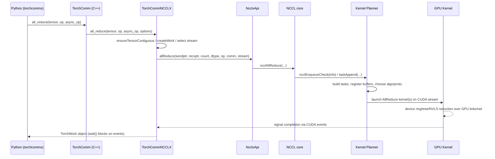
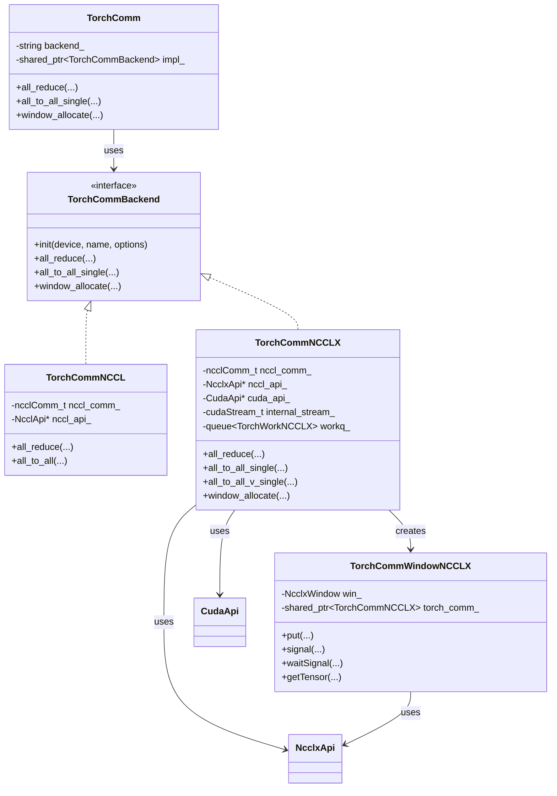
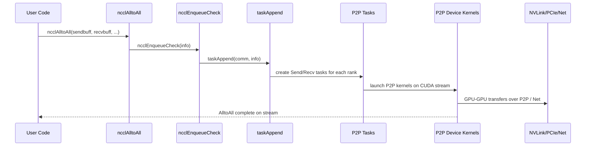
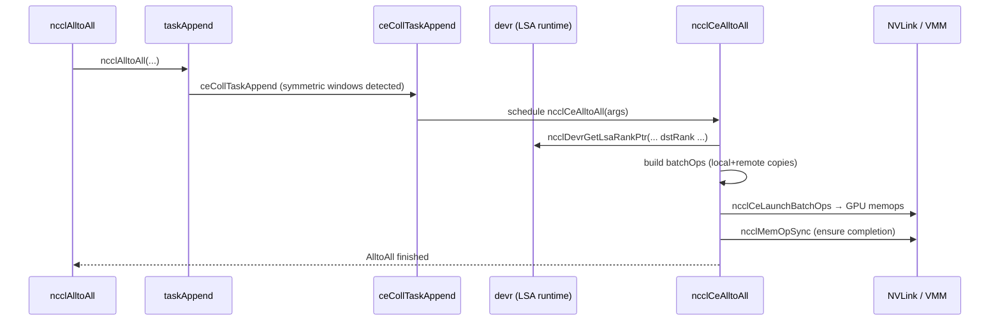

# Multi‑GPU Communication in NCCL, NVSHMEM, and TorchComms/NCCLX

This document explains, from first principles, how NCCL, NVSHMEM, and TorchComms/NCCLX implement multi‑GPU communication, with detailed code traces for `all_reduce` and all‑to‑all. All paths and links are relative to this file.

---

## 0. Quick Reference

### 0.1 Key Files

- TorchComms high‑level API and backends  
  - [TorchComm C++ frontend](../comms/torchcomms/TorchComm.hpp#L1)  
  - [TorchComm C++ implementation](../comms/torchcomms/TorchComm.cpp#L1)  
  - [TorchComms Python bindings](../comms/torchcomms/TorchCommPy.cpp#L1)  
  - [TorchComms Python package entry](../comms/torchcomms/__init__.py#L1)  
  - [Backend wrapper (PyTorch `c10d` adapter)](../comms/torchcomms/BackendWrapper.cpp#L1)  
  - [Backend factory / registry](../comms/torchcomms/TorchCommFactory.cpp#L1)

- TorchComms NCCL backend  
  - [NCCL backend class](../comms/torchcomms/nccl/TorchCommNCCL.hpp#L1)  
  - [NCCL backend implementation](../comms/torchcomms/nccl/TorchCommNCCL.cpp#L1)  
  - [NCCL API abstraction](../comms/torchcomms/nccl/NcclApi.hpp#L1)  
  - [Default NCCL API implementation](../comms/torchcomms/nccl/NcclApi.cpp#L1)

- TorchComms NCCLX backend  
  - [NCCLX backend class](../comms/torchcomms/ncclx/TorchCommNCCLX.hpp#L1)  
  - [NCCLX backend implementation](../comms/torchcomms/ncclx/TorchCommNCCLX.cpp#L1)  
  - [NCCLX API abstraction](../comms/torchcomms/ncclx/NcclxApi.hpp#L1)  
  - [Default NCCLX API implementation](../comms/torchcomms/ncclx/NcclxApi.cpp#L1)  
  - [NCCLX window/RMA wrapper](../comms/torchcomms/ncclx/TorchCommWindowNCCLX.hpp#L1)  
  - [NCCLX window implementation](../comms/torchcomms/ncclx/TorchCommWindowNCCLX.cpp#L1)

- NCCL core library (third‑party)  
  - [Host‑side collectives API](../thirdparty/nccl/src/collectives.cc#L80)  
  - [Enqueue, kernel planning, task building](../thirdparty/nccl/src/enqueue.cc#L2545)  
  - [Collectives constants & helpers](../thirdparty/nccl/src/include/collectives.h#L1)  
  - [Device‑side AllReduce kernels](../thirdparty/nccl/src/device/all_reduce.h#L1)  
  - [Device‑side primitives (LL/LL128/Simple)](../thirdparty/nccl/src/device/primitives.h#L1)  
  - [Transport P2P (NVLink/PCIe + IPC/VMM)](../thirdparty/nccl/src/transport/p2p.cc#L180)  
  - [Transport network (InfiniBand / RoCE plugins)](../thirdparty/nccl/src/transport/net.cc#L1)  
  - [Symmetric memory runtime (VMM)](../thirdparty/nccl/src/dev_runtime.cc#L150)  
  - [Symmetric kernels interface](../thirdparty/nccl/src/include/sym_kernels.h#L27)  
  - [Symmetric AllReduce kernels](../thirdparty/nccl/src/device/symmetric/all_reduce.cuh#L258)  
  - [Symmetric kernel scheduler](../thirdparty/nccl/src/scheduler/symmetric_sched.cc#L1)  
  - [Registration APIs and user buffers](../thirdparty/nccl/src/register/register.cc#L20)  
  - [Collective buffer registration](../thirdparty/nccl/src/register/coll_reg.cc#L20)  
  - [Global init, env, and window enable](../thirdparty/nccl/src/init.cc#L50)

- NVSHMEM core library  
  - [Top‑level headers](../thirdparty/nvshmem/src/include/nvshmem.h#L1)  
  - [Host‑side collectives – all‑to‑all](../thirdparty/nvshmem/src/host/coll/alltoall/alltoall.cpp#L20)  
  - [Host‑side all‑to‑all on stream](../thirdparty/nvshmem/src/host/coll/alltoall/alltoall_on_stream.cpp#L20)  
  - [Host‑side reduction collectives (allreduce)](../thirdparty/nvshmem/src/host/coll/rdxn/rdxn.cpp#L20)  
  - [Async reduction on stream](../thirdparty/nvshmem/src/host/coll/rdxn/rdxn_on_stream.cpp#L20)  
  - [Core `reduce_on_stream` dispatcher](../thirdparty/nvshmem/src/host/coll/rdxn/rdxn.h#L22)  
  - [Device‑side collectives entrypoints](../thirdparty/nvshmem/src/include/internal/non_abi/nvshmemi_h_to_d_coll_defs.cuh#L66)  
  - [Collective launch infrastructure](../thirdparty/nvshmem/src/device/launch/collective_launch.cpp#L20)  
  - [Host comm RMA launcher](../thirdparty/nvshmem/src/host/comm/rma.cu#L10)  
  - [Signal/wait stream primitives](../thirdparty/nvshmem/src/host/comm/sync.cpp#L20)  
  - [Team and device reduce kernel launcher](../thirdparty/nvshmem/src/host/team/team_internal_cuda.cu#L20)

### 0.2 Key Functions Index

| Function / Method | File | Purpose |
|-------------------|------|---------|
| `ncclAllReduce` | `../thirdparty/nccl/src/collectives.cc#L107` | Host NCCL C API entry for AllReduce; builds `ncclInfo` and enqueues work. |
| `ncclAlltoAll` | `../thirdparty/nccl/src/collectives.cc#L94` | Host NCCL C API entry for all‑to‑all; currently lowered to P2P send/recv tasks. |
| `ncclEnqueueCheck` | `../thirdparty/nccl/src/enqueue.cc#L2620` | Validates arguments, ensures communicator readiness, and appends tasks to the planner. |
| `taskAppend` | `../thirdparty/nccl/src/enqueue.cc#L2548` | Converts an `ncclInfo` into collectives or P2P tasks; handles AllToAll via send/recv. |
| `RunWorkColl<ncclFuncAllReduce>` | `../thirdparty/nccl/src/device/all_reduce.h#L200` | Device‑side specialization that chooses algorithm (RING/TREE/COLLNET/NVLS) and runs AllReduce. |
| `ncclP2pAllocateShareableBuffer` | `../thirdparty/nccl/src/transport/p2p.cc#L210` | Allocates shareable GPU buffers using either VMM (`cuMem*`) or legacy CUDA IPC. |
| `ncclCommRegister` | `../thirdparty/nccl/src/register/register.cc#L60` | Public API to register user buffers (UBs) with NCCL for reuse across collectives. |
| `nvshmem_TYPENAME_alltoall` | `../thirdparty/nvshmem/src/host/coll/alltoall/alltoall.cpp#L20` | Host NVSHMEM blocking all‑to‑all; delegates to on‑stream implementation then synchronizes. |
| `nvshmemi_alltoall_on_stream` | `../thirdparty/nvshmem/src/host/coll/alltoall/alltoall.h#L50` | Core all‑to‑all implementation: chooses NCCL, NVLS P2P memcpy, or NVSHMEM device kernel. |
| `nvshmemi_reduce_on_stream` | `../thirdparty/nvshmem/src/host/coll/rdxn/rdxn.h#L26` | Core AllReduce implementation; chooses NCCL AllReduce or NVSHMEM GPU kernel. |
| `rdxn_on_stream_kernel` | `../thirdparty/nvshmem/src/include/internal/non_abi/nvshmemi_h_to_d_coll_defs.cuh#L97` | CUDA device kernel that performs reduction across PEs using NVSHMEM’s device collectives. |
| `TorchComm::all_reduce` | `../comms/torchcomms/TorchComm.cpp#L54` | High‑level TorchComms API that forwards to the selected backend’s `all_reduce`. |
| `TorchCommNCCLX::all_reduce` | `../comms/torchcomms/ncclx/TorchCommNCCLX.cpp#L589` | NCCLX backend implementation of AllReduce using `NcclxApi::allReduce`. |
| `TorchCommNCCLX::all_to_all_single` | `../comms/torchcomms/ncclx/TorchCommNCCLX.cpp#L1071` | NCCLX backend all‑to‑all using NCCL’s native `ncclAllToAll`. |
| `TorchCommNCCLX::all_to_all_v_single` | `../comms/torchcomms/ncclx/TorchCommNCCLX.cpp#L1124` | NCCLX backend variable‑size all‑to‑all using `ncclAllToAllv`. |
| `DefaultNcclxApi::allToAll` | `../comms/torchcomms/ncclx/NcclxApi.cpp#L155` | Thin shim that calls `ncclAllToAll` from the NCCLX‑enabled NCCL library. |
| `DefaultNcclxApi::winAllocate` | `../comms/torchcomms/ncclx/NcclxApi.cpp#L260` | Allocates an NCCL window (symmetric RMA buffer) using NCCL RMA extension APIs. |
| `TorchCommWindowNCCLX::allocate` | `../comms/torchcomms/ncclx/TorchCommWindowNCCLX.cpp#L60` | Allocates an NCCLX RMA window and wires it up with TorchComms. |
| `TorchCommNCCL::all_to_all` | `../comms/torchcomms/nccl/TorchCommNCCL.cpp#L1048` | NCCL backend all‑to‑all implemented as explicit P2P send/recv loop. |

---

## 1. Big‑Picture Architectural Comparison

At a very high level:

- **NCCL** is a host‑driven collective communication library. The user calls `ncclAllReduce` / `ncclAlltoAll`, NCCL builds internal tasks, schedules them across channels, and launches CUDA kernels that implement communication patterns (ring, tree, NVLS, CollNet). Inter‑GPU communication is performed via:
  - Intra‑node: CUDA P2P (NVLink, PCIe) over NCCL “channels” with per‑connection FIFOs.  
  - Inter‑node: network transports (IB/RoCE plugins) plus proxy threads, optionally with GPUDirect RDMA and GDRCopy.  
  - Newer NCCL versions also expose **symmetric memory** and **symmetric kernels**, enabling device‑initiated collectives on VMM‑mapped windows.

- **NVSHMEM** is a GPU‑centric, PGAS‑style library. It presents a **symmetric heap** and one‑sided put/get operations (`nvshmem_put`, `nvshmem_get`) plus collectives that can be called from host or device. Collectives like AllReduce and all‑to‑all:
  - Are layered on top of NVSHMEM’s device runtime and “threadgroup” collectives.  
  - Can internally use NCCL (if enabled) for some algorithms/sizes.  
  - Are launched via specialized collective launch infrastructure that uses CUDA cooperative kernels and high‑priority streams.

- **TorchComms/NCCLX** is a PyTorch‑oriented communication layer that:
  - Provides a **unified Python API** (`torchcomms.new_comm`, `comm.all_reduce`, `comm.all_to_all_single`, windows, etc.).  
  - Abstracts over backends (`nccl`, `ncclx`, `gloo`, `rccl`, `rcclx`), with **NCCLX** targeting the extended NCCL (user buffers, RMA windows, all‑to‑allv, symmetric kernels).  
  - Adds Torch‑specific integration: CUDA graph support, timeouts and async error handling, internal streams/events, batching, and integration with PyTorch's caching allocator.

The rest of this document proceeds **top‑down** for each framework:

1. Explain architecture and core abstractions.  
2. Build a source map.  
3. Trace AllReduce and all‑to‑all, frame‑by‑frame.  
4. Extract CUDA/system primitives (P2P, IPC, VMM, device‑initiated kernels).  
5. Compare NCCL vs NVSHMEM vs TorchComms/NCCLX, emphasizing where NCCLX improves on plain NCCL.

---

## 2. NCCL

### 2.1 System Architecture (First Principles)

At its core, NCCL structures communication around:

- **Communicators (`ncclComm_t`)**  
  Represent a group of ranks participating in collectives. Key fields (see [`comm.h`](../thirdparty/nccl/src/include/comm.h#L666)):
  - `nRanks`, `rank`, `nNodes`, topology info.  
  - `channels[]`: per‑channel send/recv state, rings and trees.  
  - `devComm`: device‑side mirror of the communicator for kernels.  
  - `planner`: per‑group kernel planner (`coll sorter`, `tasks`, `plans`).  
  - `devrState`: symmetric memory runtime state.  
  - `symkState`: symmetric kernels state (device‑initiated collectives).  
  - `regCache`: user buffer registration cache.

- **Collective descriptors (`ncclInfo`)**  
  Each high‑level API call (`ncclAllReduce` etc.) is converted into a simple struct describing:
  - Which op: `func` (`ncclFuncAllReduce`, `ncclFuncAlltoAll`, …)  
  - Data buffers: `sendbuff`, `recvbuff`, `count`, `datatype`, `op`, `root`.  
  - Execution context: `comm`, `stream`, `chunkSteps`, `sliceSteps`.  
  Defined in [`collectives.h`](../thirdparty/nccl/src/include/collectives.h#L20).

- **Planner and tasks (`ncclTaskColl`, `ncclKernelPlan`)**  
  The planner builds:
  - A list of **collective tasks** (`ncclTaskColl`) sorted and grouped by (function, op, datatype).  
  - For each group, chosen algorithm (RING/TREE/NVLS/COLLNET) and protocol (LL/LL128/Simple).  
  - One or more **kernel plans** (`ncclKernelPlan`) describing:
    - Which kernel to launch (standard or symmetric).  
    - How much work per channel, per batch.  
    - How device‑side “work items” (`ncclDevWorkColl[...]`) are laid out.

- **Device kernels & primitives**  
  Device‑side code lives under [`device/`](../thirdparty/nccl/src/device). The structure is:
  - Per‑collective header (e.g. [AllReduce](../thirdparty/nccl/src/device/all_reduce.h#L1)) that defines `RunWorkColl<func, algo, proto>` specializations.  
  - Common primitives (LL/LL128/Simple) in [primitives.h](../thirdparty/nccl/src/device/primitives.h#L1) and friends.  
  - Transport‑specific device code under [`device/network`](../thirdparty/nccl/src/device/network/kernel.cuh#L1).  
  - Symmetric kernels under [`device/symmetric`](../thirdparty/nccl/src/device/symmetric/kernel.cuh#L1).

- **Transports and proxy threads**  
  Under [`transport/`](../thirdparty/nccl/src/transport):
  - **P2P transport** ([`p2p.cc`](../thirdparty/nccl/src/transport/p2p.cc#L180)) sets up NVLink/PCIe peer access, CUDA IPC or VMM mappings.  
  - **Network transport** ([`net.cc`](../thirdparty/nccl/src/transport/net.cc#L1)) integrates with net plugins (IB/RoCE).  
  - A **proxy thread** ([`proxy.cc`](../thirdparty/nccl/src/proxy.cc#L1)) runs on the host to drive network operations decoupled from GPU kernels.

- **Registration (User Buffers vs default)**  
  The registration subsystem ([`register.cc`](../thirdparty/nccl/src/register/register.cc#L20), [`coll_reg.cc`](../thirdparty/nccl/src/register/coll_reg.cc#L20)) manages:
  - A cache of registered regions per communicator (`ncclRegCache`).  
  - Local registration with net, NVLS, and IPC backends.  
  - Public APIs `ncclCommRegister` / `ncclCommDeregister` used by higher‑level runtimes (e.g. NCCLX).

- **Symmetric memory & device‑initiated kernels**  
  Enabled when:
  - `WIN_ENABLE` is set and `ncclCuMemEnable()` is true (VMM available) in [`init.cc`](../thirdparty/nccl/src/init.cc#L50).  
  - Symmetric runtime in [`dev_runtime.cc`](../thirdparty/nccl/src/dev_runtime.cc#L150) successfully maps a flat virtual address space across GPUs using `cuMemAddressReserve`, `cuMemMap`, and `cuMemSetAccess`.  
  - Symmetric kernels in [`sym_kernels.cc`](../thirdparty/nccl/src/sym_kernels.cc#L20) and [`device/symmetric/*.cuh`](../thirdparty/nccl/src/device/symmetric/all_reduce.cuh#L258) are available and selected by the scheduler.

From a systems view:

- NCCL is mostly **host‑driven**: the host builds tasks and launches one or a small number of kernels per group of operations.  
- Once kernels are running, **GPU threads themselves move data** over GPU‑GPU links and network queues using device primitives.  
- New symmetric kernels extend this to **device‑initiated collectives** over symmetric memory windows, minimizing host involvement and leveraging VMM.

---

### 2.2 NCCL Source Map

**Top‑level NCCL layout**

- `thirdparty/nccl/src/collectives.cc` – public C API for collectives.  
- `thirdparty/nccl/src/enqueue.cc` – enqueue logic, kernel planning, and task building.  
- `thirdparty/nccl/src/device/` – device kernels and primitives.  
- `thirdparty/nccl/src/transport/` – intra‑node P2P and inter‑node network transports.  
- `thirdparty/nccl/src/register/` – user buffer and collective buffer registration.  
- `thirdparty/nccl/src/dev_runtime.cc` – symmetric memory runtime built on CUDA VMM.  
- `thirdparty/nccl/src/sym_kernels.cc` & `device/symmetric` – device‑initiated collective kernels.  
- `thirdparty/nccl/src/init.cc` – initialization, env params (e.g. `WIN_ENABLE`), and communicator setup.

**AllReduce‑relevant files**

- [Collectives API](../thirdparty/nccl/src/collectives.cc#L107) – `ncclAllReduce` entrypoint.  
- [Collectives helpers](../thirdparty/nccl/src/include/collectives.h#L20) – `ALLREDUCE_*` constants, type sizes.  
- [Enqueue & tasks](../thirdparty/nccl/src/enqueue.cc#L2548) – `taskAppend`, `ncclEnqueueCheck`.  
- [Device AllReduce](../thirdparty/nccl/src/device/all_reduce.h#L200) – algorithm‑specific `RunWorkColl` implementations.  
- [Device primitives](../thirdparty/nccl/src/device/primitives.h#L1) – send/recv/reduce primitives used by kernels.  
- [Transport P2P](../thirdparty/nccl/src/transport/p2p.cc#L210) – GPU P2P buffer allocation via IPC/VMM.

**All‑to‑all‑relevant files**

- [AlltoAll API](../thirdparty/nccl/src/collectives.cc#L94) – `ncclAlltoAll`.  
- [Enqueue AlltoAll path](../thirdparty/nccl/src/enqueue.cc#L2585) – expands to P2P send/recv tasks.  
- [Device send/recv primitives](../thirdparty/nccl/src/device/sendrecv.h#L1) – device‑side P2P operations.  
- Note: NCCL currently lowers `AlltoAll` to many P2P ops instead of a dedicated AlltoAll kernel; NCCLX uses additional APIs that add more efficient paths.

---

### 2.3 AllReduce Execution Path (Host → Device → GPU‑GPU Links)

We now trace an NCCL AllReduce starting from `ncclAllReduce` down to device primitives.

#### 2.3.1 Host entrypoint: `ncclAllReduce`

**Code (simplified)** – [`collectives.cc`](../thirdparty/nccl/src/collectives.cc#L107):

```cpp
NCCL_API(ncclResult_t, ncclAllReduce, const void* sendbuff, void* recvbuff, size_t count,
    ncclDataType_t datatype, ncclRedOp_t op, ncclComm* comm, cudaStream_t stream);
ncclResult_t ncclAllReduce(const void* sendbuff, void* recvbuff, size_t count,
    ncclDataType_t datatype, ncclRedOp_t op, ncclComm* comm, cudaStream_t stream) {
  NVTX3_FUNC_WITH_PARAMS(AllReduce, NcclNvtxParamsAllReduce,
    NVTX3_PAYLOAD(comm ? comm->commHash : 0, count * ncclTypeSize(datatype), op));

  struct ncclInfo info = { ncclFuncAllReduce, "AllReduce",
    sendbuff, recvbuff, count, datatype, op, 0, comm, stream,
    ALLREDUCE_CHUNKSTEPS, ALLREDUCE_SLICESTEPS };
  return ncclEnqueueCheck(&info);
}
```

**What happens:**

- Constructs an `ncclInfo` describing the AllReduce:
  - `sendbuff` / `recvbuff`: user buffers on (typically) GPU memory.  
  - `count`, `datatype`, `op`: logical view of the data and reduction.  
  - `comm`, `stream`: communicator and CUDA stream to associate with the work.  
  - `chunkSteps` / `sliceSteps`: tuning parameters from [`collectives.h`](../thirdparty/nccl/src/include/collectives.h#L20) that control pipeline granularity.
- Emits an NVTX range for profiling.  
- Hands control to `ncclEnqueueCheck`, which performs validation and queues the operation.

#### 2.3.2 Enqueue and task building: `ncclEnqueueCheck` and `taskAppend`

**Code** – [`enqueue.cc`](../thirdparty/nccl/src/enqueue.cc#L2620):

```cpp
ncclResult_t ncclEnqueueCheck(struct ncclInfo* info) {
  ncclResult_t ret = CommCheck(info->comm, info->opName, "comm");
  if (ret != ncclSuccess) return ncclGroupErrCheck(ret);
  if (info->comm->revokedFlag) {
    WARN("%s: communicator was revoked", info->opName);
    return ncclGroupErrCheck(ncclInvalidUsage);
  }

  NCCLCHECK(ncclGroupStartInternal());
  ret = ncclSuccess;

  NCCLCHECKGOTO(ncclCommEnsureReady(info->comm), ret, fail);

  if (info->comm->checkPointers) {
    CUDACHECKGOTO(cudaGetDevice(&devOld), ret, fail);
    CUDACHECKGOTO(cudaSetDevice(info->comm->cudaDev), ret, fail);
  }
  NCCLCHECKGOTO(ArgsCheck(info), ret, fail);

  INFO(NCCL_COLL, "%s: opCount %lx sendbuff %p recvbuff %p count %zu ...",
       info->opName, info->comm->opCount, info->sendbuff, info->recvbuff, info->count, ...);

  NCCLCHECKGOTO(taskAppend(info->comm, info), ret, fail);
  ...
  NCCLCHECK(ncclGroupEndInternal());
  if (info->comm && !info->comm->config.blocking) {
    NCCLCHECK(ncclCommGetAsyncError(info->comm, &ret));
  }
  return ret;
}
```

**Key steps:**

1. **Communicator validity**: `CommCheck` rejects invalid or revoked communicators.  
2. **Group semantics**: wraps the operation in an internal `ncclGroupStartInternal/EndInternal` so that multiple collectives in a user group are processed together.  
3. **Initialization barrier**: `ncclCommEnsureReady` waits for background initialization (topology discovery, transport setup) to complete.  
4. **Pointer checks**: optionally switches the CUDA device to `comm->cudaDev` and validates buffer pointers (`ArgsCheck`).  
5. **Task append**: hands off to `taskAppend`, which converts this `ncclInfo` into concrete tasks for the planner.

**Task construction** – [`enqueue.cc`](../thirdparty/nccl/src/enqueue.cc#L2548):

```cpp
static ncclResult_t taskAppend(struct ncclComm* comm, struct ncclInfo* info) {
  ncclFunc_t collAPI = info->coll;
  if (info->coll == ncclFuncSend || info->coll == ncclFuncRecv) {
    NCCLCHECK(p2pTaskAppend(...));
  } else {
    if (info->count == 0) return ncclSuccess;

    struct ncclDevRedOpFull opDev;
    NCCLCHECK(hostToDevRedOp(&opDev, info->op, info->datatype, comm));

    if (comm->nRanks == 1) {
      NCCLCHECK(ncclLaunchOneRank(...));
      return ncclSuccess;
    } else {
      struct ncclDevrWindow* sendWin;
      struct ncclDevrWindow* recvWin;
      ncclDevrFindWindow(comm, info->sendbuff, &sendWin);
      ncclDevrFindWindow(comm, info->recvbuff, &recvWin);
      bool ceImplemented = ncclCeImplemented(info->coll, info->op, info->datatype);

      if (comm->symmetricSupport && ... && sendWin && recvWin && ... && ceImplemented) {
        // Device‑initiated CE collective on symmetric windows
        NCCLCHECK(ceCollTaskAppend(comm, info, sendWin, recvWin, opDev));
      } else {
        if (info->coll == ncclFuncAlltoAll) {
          // AlltoAll lowered to sends/recvs
          for (int r=0; r<comm->nRanks; r++) {
            NCCLCHECK(p2pTaskAppend(... ncclFuncSend, ...));
            NCCLCHECK(p2pTaskAppend(... ncclFuncRecv, ...));
          }
        } else {
          // Standard collective task
          NCCLCHECK(collTaskAppend(comm, info, opDev));
        }
      }
    }
  }
  return ncclSuccess;
}
```

**Conceptually:**

- For AllReduce (`info->coll == ncclFuncAllReduce`), we go down the **`collTaskAppend` path**.  
- For AllToAll, we instead generate a **batch of P2P send/recv tasks**; this is why NCCL’s default all‑to‑all is effectively a structured P2P pattern.  
- If symmetric windows are present and CE (compute‑engine) collectives are supported, the operation can be scheduled as a **device‑initiated symmetric kernel**.

#### 2.3.3 Planning and registration: `ncclPrepareTasks` and `ncclTasksRegAndEnqueue`

Once tasks are appended, group processing (inside `ncclGroupEndInternal`) invokes the planner to:

1. Sort and bucket tasks by `(func, op, datatype)`.  
2. Choose algorithms & protocols.  
3. Optionally **extract symmetric tasks** (for symmetric kernels).  
4. Register buffers (NVLS/CollNet/IPC) and build `ncclDevWorkColl[...]` structures.

Two important pieces:

- **NVLS and CollNet registration** – [`coll_reg.cc`](../thirdparty/nccl/src/register/coll_reg.cc#L20)  
  For NVLS AllReduce/AllGather/ReduceScatter, `ncclRegisterCollNvlsBuffers`:
  - Checks env (`LOCAL_REGISTER`, graph registration flags).  
  - Attempts NVLS graph registration, then local registration, filling `regBufSend/Recv`.  
  - Optionally registers CollNet network buffers (send/recv handles).  
  - Marks `info->regBufType` with `NCCL_NVLS_REG_BUFFER` / `NCCL_NET_REG_BUFFER`.  
  - Sets `regNeedConnect` so the planner knows whether to trigger runtime connection.

- **Work struct construction** – `ncclTasksRegAndEnqueue` in [`enqueue.cc`](../thirdparty/nccl/src/enqueue.cc#L200):

```cpp
ncclResult_t ncclTasksRegAndEnqueue(struct ncclComm* comm) {
  ...
  struct ncclTaskColl *task = ncclIntruQueueHead(&planner->collTaskQueue);
  while (task != nullptr) {
    void* regBufSend[NCCL_MAX_LOCAL_RANKS];
    void* regBufRecv[NCCL_MAX_LOCAL_RANKS];
    bool regNeedConnect = true;
    struct ncclDevWorkColl devWork = {};

    if (task->algorithm == NCCL_ALGO_NVLS_TREE || task->algorithm == NCCL_ALGO_NVLS) {
      // For NVLS algos we handled above and return early.
      ...
    }

    ncclRegisterCollBuffers(comm, task, regBufSend, regBufRecv,
                            &planner->collCleanupQueue, &regNeedConnect);

    devWork.sendbuff = (void*)task->sendbuff;
    devWork.recvbuff = (void*)task->recvbuff;
    devWork.sendbuffOffset = task->sendbuffOffset;
    devWork.recvbuffOffset = task->recvbuffOffset;
    devWork.sendbuffRmtAddrs = task->sendbuffRmtAddrs;
    devWork.recvbuffRmtAddrs = task->recvbuffRmtAddrs;
    devWork.root = task->root;
    devWork.nWarps = task->nWarps;
    devWork.redOpArg = task->opDev.scalarArg;
    devWork.redOpArgIsPtr = task->opDev.scalarArgIsPtr;
    devWork.oneNode = (comm->nNodes == 1);
    devWork.isOneRPN = comm->isOneRPN;
    devWork.netRegUsed = devWork.regUsed = 0;
    ...
    if (task->regBufType & NCCL_NET_REG_BUFFER) devWork.netRegUsed = 1;
    if (task->regBufType & (NCCL_IPC_REG_BUFFER | NCCL_NVLS_REG_BUFFER))
      devWork.regUsed = 1;
    ...
    // Wrap devWork into ncclWorkList nodes and enqueue into planner->collWorkQueue
  }
}
```

This step is where NCCL decides, **per collective**, whether:

- Registered network buffers (UBs / CollNet) can be used.  
- Registered NVLS or IPC buffers are available.  
- The device kernel should treat `sendbuff`/`recvbuff` as special registered regions (`regUsed` / `netRegUsed`).

#### 2.3.4 Kernel planning and launch

The kernel planner eventually creates an `ncclKernelPlan`:

- For **standard collectives**:  
  - `plan->kernelFn` points to a standard device kernel entry (`ncclDevKernelList[...]`).  
  - `plan->kernelArgs` is filled with a `ncclDevKernelArgs` struct plus batch metadata.  
  - `plan->workStorageType` decides whether device work structs live in kernel args or separate buffers.

- For **symmetric collectives**:  
  - `ncclMakeSymmetricTaskList` in [`symmetric_sched.cc`](../thirdparty/nccl/src/scheduler/symmetric_sched.cc#L1) collects tasks whose buffers lie in symmetric windows (`sendWin` / `recvWin` with `NCCL_WIN_COLL_SYMMETRIC`).  
  - `ncclSymkPickKernel` selects an appropriate symmetric kernel (e.g. `AllReduce_RSxLD_AGxST`).  
  - `ncclSymmetricTaskScheduler` packs these tasks into a `ncclSymkDevWorkArgs` struct and sets `plan->kernelFn` to a symmetric kernel entry.

Finally, NCCL launches the kernels via `cudaLaunchKernel` / `cudaLaunchCooperativeKernel` (through wrapper functions in `dev_runtime` and related code).

#### 2.3.5 Device AllReduce kernels and GPU‑GPU communication

**Standard AllReduce** – [`device/all_reduce.h`](../thirdparty/nccl/src/device/all_reduce.h#L200):

```cpp
template<typename T, typename RedOp>
struct RunWorkColl<ncclFuncAllReduce, T, RedOp, NCCL_ALGO_RING, NCCL_PROTO_SIMPLE> {
  __device__ __forceinline__ void run(int tid, int nthreads, struct ncclDevWorkColl* work) {
    using Proto = ProtoSimple<ALLREDUCE_CHUNKSTEPS/ALLREDUCE_SLICESTEPS, ALLREDUCE_SLICESTEPS>;
    runRing<T, RedOp, Proto>(tid, nthreads, work);
  }
};
```

The **ring implementation** (same file):

```cpp
template<typename T, typename RedOp, typename Proto>
__device__ __forceinline__ void runRing(int tid, int nthreads, struct ncclDevWorkColl* work) {
  ncclRing *ring = &ncclShmem.channel.ring;
  const int nranks = ncclShmem.comm.nRanks;
  ...
  Primitives<T, RedOp, FanSymmetric<1>, 1, Proto, 0> prims(
    tid, nthreads, &ring->prev, &ring->next,
    work->sendbuff, work->recvbuff, work->redOpArg, 0, 0, 0, work);

  for (ssize_t elemOffset = 0; elemOffset < channelCount; elemOffset += loopCount) {
    ...
    // Step 0: push data to next GPU
    prims.directSend(offset, offset, nelem);
    // Steps 1..k‑2: recv+reduce+send
    prims.directRecvReduceDirectSend(offset, offset, nelem);
    // Final steps: recv+reduce+copy, then pure copies to complete the ring
    prims.directRecvReduceCopyDirectSend(offset, offset, nelem, /*postOp=*/true);
    prims.directRecvCopyDirectSend(offset, offset, nelem);
    prims.directRecv(offset, nelem);
  }
}
```

**Interpretation:**

- `ncclShmem` is per‑kernel shared memory containing per‑channel ring and tree metadata plus communicator state (`nRanks`, etc.).  
- `Primitives` encapsulate the low‑level send/recv/reduce instructions for:
  - Intra‑node: P2P reads or writes over NVLink/PCIe, potentially using LL/LL128 protocols.  
  - Inter‑node: operations on network buffers, with proxies pushing/pulling data via GPUDirect RDMA.  
- The ring kernel iterates over **chunks** of the user buffer, sending and receiving them around the ring while applying the reduction operator (`RedOp`).

**Tree / CollNet / NVLS variants** in the same header use:

- **Tree Up/Down**: `runTreeUpDown` and `runTreeSplit` performing reduction along a tree, then broadcast.  
- **CollNet**: integrates network and NVLS paths (for hierarchical collectives).  
- **NVLS**: uses SHARP offload via NVLink multicast (see the NVLS case in `RunWorkColl`).

#### 2.3.6 Device‑initiated symmetric AllReduce

Symmetric kernels operate on **symmetric memory windows** managed by `devrState`:

- `dev_runtime.cc` uses CUDA VMM:
  - `cuMemExportToShareableHandle`, `cuMemImportFromShareableHandle`.  
  - `cuMemAddressReserve`, `cuMemMap`, `cuMemSetAccess`.  
  to build a single flat virtual region (`devr->lsaFlatBase`) spanning all GPUs in the “LSA team” ([`dev_runtime.cc`](../thirdparty/nccl/src/dev_runtime.cc#L150)).

- Symmetric kernels are selected via `ncclSymkAvailable` and `ncclSymkPickKernel` and scheduled by `ncclSymmetricTaskScheduler` ([`symmetric_sched.cc`](../thirdparty/nccl/src/scheduler/symmetric_sched.cc#L120)).

Example symmetric AllReduce kernel – [`device/symmetric/all_reduce.cuh`](../thirdparty/nccl/src/device/symmetric/all_reduce.cuh#L258):

```cpp
template<template<typename> typename Red, typename T>
__device__ __forceinline__ void ncclSymkRun_AllReduce_RSxLD_AGxST(
    ncclSymkDevWorkArgs const* args) {
  ncclSymkArgsHandler handler{args};
  ncclLsaBarrierSession<ncclCoopCta> bar{
    ncclCoopCta(), handler.comm, ncclTeamTagLsa(), blockIdx.x
  };
  Red<typename ncclSymkAccumType<Red, T, /*nvls=*/false>::Type> red(handler.devWork->redOpArg);
  ...
  handler.forEachWork<T>(
    [&] __device__ (int block, int nBlocks, size_t nElts, size_t nAllElts,
                    ncclSymPtr<T> input, ncclSymPtr<T> output) {
      int gt = ...; // global thread index across ranks and blocks
      int gtn = nRanks*nBlocks*blockDim.x;
      allreduce(handler, gtn, gt, nBlocks, waitNeeded, bar, red, input, output, nElts);
      waitNeeded = false;
    });
  bar.sync(ncclCoopCta(), cuda::memory_order_release);
}
```

Key ideas:

- `ncclSymPtr<T>` is a symmetric pointer abstraction that can address **remote GPUs’ symmetric memory** using VMM.  
- The kernel:
  - Uses **multicast and load‑from‑many patterns** (e.g. `peerPtr(world, r)`) to fetch contributions from each rank.  
  - Applies the reduction (`Red`) in‑kernel.  
  - Writes results back to symmetric memory (optionally using multimem store instructions when available).  
- Barriers (`ncclLsaBarrierSession`) ensure all ranks synchronize at well‑defined points, enabling device‑driven progress without host intervention.

**How this differs from classic NCCL kernels:**

- Classic kernels see `sendbuff`/`recvbuff` mapped **locally**; cross‑GPU traffic flows through transport primitives.  
- Symmetric kernels operate over **shared virtual memory** mapped on all GPUs, using VMM and optional multicast hardware, enabling more flexible device‑initiated communication patterns with fewer host round‑trips.

---

### 2.4 All‑to‑All Execution Path

NCCL’s `AlltoAll` API exists, but as of the code in this repo it is effectively implemented as **N P2P sends + N P2P recvs**, not a standalone device collective.

#### 2.4.1 Host entrypoint: `ncclAlltoAll`

**Code** – [`collectives.cc`](../thirdparty/nccl/src/collectives.cc#L94):

```cpp
NCCL_API(ncclResult_t, ncclAlltoAll, const void* sendbuff, void* recvbuff, size_t count,
    ncclDataType_t datatype, ncclComm* comm, cudaStream_t stream);
ncclResult_t ncclAlltoAll(const void* sendbuff, void* recvbuff, size_t count,
    ncclDataType_t datatype, ncclComm* comm, cudaStream_t stream) {
  NVTX3_FUNC_WITH_PARAMS(AlltoAll, NcclNvtxParamsAlltoAll,
    NVTX3_PAYLOAD(comm ? comm->commHash : 0, count * ncclTypeSize(datatype)));

  struct ncclInfo info = { ncclFuncAlltoAll, "AlltoAll",
    sendbuff, recvbuff, count, datatype, ncclSum, 0, comm, stream,
    ALLTOALL_CHUNKSTEPS, ALLTOALL_SLICESTEPS };
  return ncclEnqueueCheck(&info);
}
```

The front‑end mirrors AllReduce: build `ncclInfo`, call `ncclEnqueueCheck`.

#### 2.4.2 Expansion to P2P send/recv tasks

In `taskAppend` we saw the AlltoAll special‑case – [`enqueue.cc`](../thirdparty/nccl/src/enqueue.cc#L2585):

```cpp
if (info->coll == ncclFuncAlltoAll) {
  for (int r=0; r<comm->nRanks; r++) {
    NCCLCHECK(p2pTaskAppend(
        comm, info, ncclFuncSend, collAPI,
        (void*)((char*)info->sendbuff + r*info->count*ncclTypeSize(info->datatype)),
        info->count, info->datatype, r));
    NCCLCHECK(p2pTaskAppend(
        comm, info, ncclFuncRecv, collAPI,
        (void*)((char*)info->recvbuff + r*info->count*ncclTypeSize(info->datatype)),
        info->count, info->datatype, r));
  }
}
```

**Interpretation:**

- For rank `i`, we conceptually treat the send buffer as `N` contiguous slices:
  - slice `r` contains data destined for rank `r`.  
  - each slice has `count` elements.  
- For each `r`:
  - Append a `Send` task sending slice `r` to peer `r`.  
  - Append a `Recv` task receiving slice `r` into the appropriate area of `recvbuff`.

These P2P tasks then follow the standard P2P path:

- Enqueued as `ncclDevWorkP2p` items.  
- Driven by device kernels in [`device/sendrecv.h`](../thirdparty/nccl/src/device/sendrecv.h#L1), which internally use `Primitives` to perform GPU‑GPU traffic.  
- Backed by transports configured in [`transport/p2p.cc`](../thirdparty/nccl/src/transport/p2p.cc#L210) and network transports where needed.

**Key implication:**  
NCCL’s default AlltoAll is **not a single collective kernel** but a structured set of P2P operations. This has implications for performance (O(N²) connections at the API level, though the library may schedule them efficiently). NCCLX adds more efficient AllToAll(AllToAllv) APIs on top of NCCL’s newer extensions, as we will see later.

---

### 2.5 CUDA & System Primitives in NCCL

NCCL relies heavily on specific CUDA and system primitives:

- **Peer‑to‑peer access within a node**
  - `cudaDeviceCanAccessPeer` to determine P2P feasibility ([`p2p.cc`](../thirdparty/nccl/src/transport/p2p.cc#L180)).  
  - Legacy CUDA IPC:  
    - `cudaIpcGetMemHandle` / `cudaIpcOpenMemHandle` to share GPU memory across processes.  
    - Used when `ncclCuMemEnable()` is false.  
  - Peer access is the foundation for both direct load/store paths and NCCL’s LL/LL128 protocols.

- **VMM (Virtual Memory Management) and cuMem APIs**
  - When `ncclCuMemEnable()` is true, NCCL uses CUDA driver APIs:  
    - `cuMemGetAllocationGranularity`, `cuMemAddressReserve`, `cuMemMap`, `cuMemSetAccess` in both:  
      - `ncclP2pAllocateShareableBuffer` / `ncclP2pImportShareableBuffer` ([`p2p.cc`](../thirdparty/nccl/src/transport/p2p.cc#L210)) for P2P buffers.  
      - `dev_runtime.cc` for symmetric memory windows ([`dev_runtime.cc`](../thirdparty/nccl/src/dev_runtime.cc#L150)).  
  - `cuMemExportToShareableHandle` / `cuMemImportFromShareableHandle` to move VMM handles between processes via sockets (UDS) or IPC.

- **Network offload and GPUDirect**
  - Network transports integrate with vendor libraries (e.g., IB verbs) via a plugin interface (`ncclNet`).  
  - GDRCopy can be enabled (`GDRCOPY_ENABLE`) to accelerate host‑pinned transfers.

- **Cooperative kernels and CUDA graphs**
  - NCCL queries kernel attributes (`cudaFuncGetAttributes`) and sets shared memory preferences (`cudaFuncSetAttribute`) during initialization ([`enqueue.cc`](../thirdparty/nccl/src/enqueue.cc#L20)).  
  - NCCL is CUDA‑graph aware (`planner->persistent`, `ncclCudaGraphValid`), and supports graph registration of buffers vs local registration (`LOCAL_REGISTER`, `GRAPH_REGISTER` flags).

Together, this stack allows NCCL to:

- Use **direct GPU loads/stores** for intra‑node communication when possible.  
- Use **VMM** to build symmetric windows across nodes for advanced kernels.  
- Use network transports that can operate directly on GPU memory (GPUDirect RDMA).

---

### 2.6 NCCL User Buffers (UBs), IPC, and VMM

**User buffers (UBs)** in NCCL are **application‑owned device buffers** that have been explicitly registered with NCCL so that:

- Transports (NVLS, CollNet, IPC, net) can reuse registration metadata.  
- Device kernels can assume a stable, registered mapping and possibly leverage hardware features (e.g., multicast, NVLS).

#### 2.6.1 Registration API: `ncclCommRegister` / `ncclCommDeregister`

**Code** – [`register.cc`](../thirdparty/nccl/src/register/register.cc#L60):

```cpp
NCCL_API(ncclResult_t, ncclCommRegister,
         const ncclComm_t comm, void* buff, size_t size, void** handle);
ncclResult_t ncclCommRegister(const ncclComm_t comm, void* buff, size_t size, void** handle) {
  if (!ncclParamLocalRegister() || ncclP2pUsesMemcpy()) {
    *handle = NULL;
    INFO(NCCL_REG, "Skipping registration for buffer %p size %zi ...", buff, size, ...);
  } else {
    NCCLCHECK(ncclRegister(comm, buff, size, /*isGraph=*/false, handle));
  }
  return ncclSuccess;
}
```

`ncclRegister`:

- Aligns the buffer to page boundaries.  
- Inserts it into `comm->regCache` as an `ncclReg` entry with separate `localRefs` and `graphRefs`.  
- Will later be used by NVLS/CollNet/IPC registration paths (e.g. `ncclNvlsLocalRegisterBuffer` in [`nvls.cc`](../thirdparty/nccl/src/transport/nvls.cc#L820)).

**Deregistration** (`ncclCommDeregister`) decrements reference counts and, when they reach zero, calls `regCleanup` to:

- Deregister with net, NVLS, CollNet.  
- Close IPC handles and free remote address arrays.

#### 2.6.2 NVLS UB paths

Example UB handling – [`nvls.cc`](../thirdparty/nccl/src/transport/nvls.cc#L820):

```cpp
ncclResult_t ncclNvlsLocalRegisterBuffer(..., const void *sendbuff, void *recvbuff,
                                         size_t sendbuffSize, size_t recvbuffSize,
                                         int *outRegBufUsed, void **outRegBufSend, void **outRegBufRecv) {
  ...
  NCCLCHECK(ncclRegFind(comm, sendbuff, sendbuffSize, &sendRegRecord));
  NCCLCHECK(ncclRegLocalIsValid(sendRegRecord, &sendIsValid));
  if (sendIsValid) {
    CUCHECK(cuMemGetAddressRange((CUdeviceptr *)&baseSend, &baseSendSize, (CUdeviceptr)sendbuff));
    if ((uint64_t)baseSend + baseSendSize < (uint64_t)sendbuff + sendbuffSize) {
      // virtual address backed by multiple physical regions → fall back to non‑UB path
      goto exit;
    }
  }
  ...
  if (sendIsValid && recvIsValid)
    NCCLCHECK(nvlsRegisterBuffer(..., sendRegRecord, recvRegRecord, outRegBufUsed,
                                 outRegBufSend, outRegBufRecv));
}
```

**Key properties of UBs:**

- Only usable when:
  - The buffer is registered (`ncclRegFind` succeeds).  
  - Its virtual address range maps to a **single physical region** (`cuMemGetAddressRange` test).  
- When UB conditions hold:
  - NVLS/CollNet can register them once and reuse registration across many collectives.  
  - Kernels can treat them specially (e.g., for NVLS SHARP offload or more aggressive pipeline scheduling).

In device code, UBs change behavior:

- Some device kernels check `work->regUsed` / `work->netRegUsed`.  
- For UBs, NVLS code ensures send rate is throttled appropriately to avoid congestion (see comments in [`all_gather.h`](../thirdparty/nccl/src/device/all_gather.h#L260) and [`all_reduce.h`](../thirdparty/nccl/src/device/all_reduce.h#L200)).

#### 2.6.3 Default GPU‑to‑GPU communication vs UB paths

**Default path (no UB):**

- Buffers are not pre‑registered. For each collective:
  - NCCL may allocate **temporary internal buffers** using `ncclP2pAllocateShareableBuffer` (with either VMM or IPC) or network registration.  
  - Transport endpoints are configured on‑demand.  
  - Device kernels read/write user buffers and internal FIFOs; proxies drive inter‑node transfers.

**UB path:**

- Application (or a higher‑level runtime like TorchComms/NCCLX) explicitly calls `ncclCommRegister` to register frequently used buffers.  
- Registration:
  - Caches transport handles and remote addresses once per communicator.  
  - Lets NVLS/CollNet treat those buffers as **long‑lived endpoints**.  
  - Reduces setup overhead and improves throughput, especially for repeated collectives over the same tensors.

In short, **UBs trade setup work for upfront registration cost**, enabling faster steady‑state collectives, especially in NVLS and CollNet paths.

---

### 2.7 NCCL’s New Device‑Initiated Communication Kernels

NCCL’s “symmetric kernels” (symk) and symmetric runtime (`devr`) extend the classic model with:

- **Symmetric memory windows** mapped into each GPU’s address space via VMM.  
- **Device‑initiated collectives** that run entirely on the GPU, with:
  - Cooperative groups across ranks.  
  - Load‑from‑many and multicast store instructions (where hardware supports it).  
  - Hardware NVLS (NVLink SHARP) integration for certain algorithms.

The flow for a symmetric AllReduce:

1. **Window creation** – host side:
   - `ncclDevrWindowRegisterInGroup` and related APIs in `dev_runtime` allocate a symmetric memory region using VMM.  
   - Each rank obtains a local pointer (`devr->lsaFlatBase + offset`) representing the same logical window.

2. **Task detection** – scheduler:
   - `ncclMakeSymmetricTaskList` ([`symmetric_sched.cc`](../thirdparty/nccl/src/scheduler/symmetric_sched.cc#L1)) filters tasks whose `sendbuff` and `recvbuff` lie in symmetric windows (`sendWin`, `recvWin` with `NCCL_WIN_COLL_SYMMETRIC`).  
   - Computes total work and uses `ncclSymkPickKernel` to select a kernel variant and number of channels/warps.

3. **Work struct construction**:
   - `ncclSymmetricTaskScheduler` packs `ncclSymkDevWork` entries into `ncclSymkDevWorkArgs`, which includes:
     - A device copy of communicator state (`kcomm`).  
     - A channel work‑range table.  
     - A list of per‑collective work descriptors.

4. **Kernel launch**:
   - A symmetric kernel (e.g. `ncclSymkRun_AllReduce_RSxLD_AGxST`) is launched with `nBlocks`/`nThreads` chosen by a performance model ([`sym_kernels.cc`](../thirdparty/nccl/src/sym_kernels.cc#L120)).  
   - Kernel uses `ncclSymPtr` to access symmetric memory across ranks and implements the collective **entirely in device code**, using NVLS / multicast hardware where available.

Compared to classic NCCL:

- **Fewer host transitions** – host mostly sets up windows and launches a kernel; GPU does the rest.  
- **Better composability with device code** – symmetric collectives can be invoked from GPU code that already uses the same windows.  
- **More opportunities for NVLS offload and multimem instructions**.

TorchComms/NCCLX builds on this functionality by exposing window/RMA APIs at the PyTorch level; see §4.

---

## 3. NVSHMEM

### 3.1 Architecture Overview

NVSHMEM implements a **GPU‑centric PGAS model** with:

- A **symmetric heap**: each PE (processing element / rank) allocates symmetric objects that are accessible from all PEs with the same virtual address.  
- **Device APIs**: `nvshmem_put`, `nvshmem_get`, and device‑initiated collectives (reduce, broadcast, alltoall, barriers) implemented using NVSHMEM’s internal device runtime.  
- **Host APIs**:
  - Initialize/tear‑down the NVSHMEM runtime (`nvshmem_init`, `nvshmem_finalize`).  
  - Provide blocking and on‑stream variants of collectives, e.g., `nvshmem_TYPENAME_sum_reduce` and `nvshmemx_TYPENAME_sum_reduce_on_stream`.  
  - Manage streams, events, and cooperative launches.

Directory structure:

- `src/host/` – host‑side code:
  - `coll/` – collectives (reduce, alltoall, fcollect, reducescatter, etc.).  
  - `comm/` – RMA and signaling helpers (`rma.cu`, `amo.cpp`, `sync.cpp`).  
  - `transport/` – host‑side transport selection and endpoints.  
  - `team/` – team management and team‑based collectives.  
  - `stream/` – stream utilities and on‑stream collectives.  
  - `bootstrap`, `topo` – bootstrap and topology discovery.  

- `src/device/` – device‑side support:
  - `launch/collective_launch.cpp` – cooperative launch for collectives.  
  - `init/init_device.cu` – device‑side initialization.

- `src/include/` – headers:
  - `device_host`, `non_abi/device` – device collectives, threadgroup utilities.  
  - `internal/non_abi/nvshmemi_h_to_d_coll_defs.cuh` – host‑to‑device collective kernel entrypoints.  

Operationally:

- NVSHMEM uses **host APIs** primarily as thin wrappers that select an algorithm/backend (NCCL vs NVLS vs device kernels) and then:
  - Launch an appropriate CUDA kernel, often cooperatively across GPUs.  
  - Synchronize streams as needed for blocking calls.

We’ll now trace AllReduce and all‑to‑all.

---

### 3.2 AllReduce Execution Path (NVSHMEM)

NVSHMEM’s reduction collectives (including AllReduce) are implemented as `reduce` operations on team objects.

#### 3.2.1 Host API: blocking and on‑stream reduce

Blocking host API – [`rdxn.cpp`](../thirdparty/nvshmem/src/host/coll/rdxn/rdxn.cpp#L20):

```cpp
#define DEFN_NVSHMEM_TYPENAME_OP_REDUCE(TYPENAME, TYPE, OP)             \
  int nvshmem_##TYPENAME##_##OP(                                       \
      nvshmem_team_t team, TYPE *dest, const TYPE *source, size_t nreduce) { \
    NVTX_FUNC_RANGE_IN_GROUP(COLL);                                    \
    NVSHMEMI_CHECK_INIT_STATUS();                                      \
    NVSHMEM_API_NOT_SUPPORTED_WITH_LIMITED_MPG_RUNS();                 \
    nvshmemi_reduce_on_stream<TYPE, RDXN_OPS_##OP>(                    \
        team, dest, source, nreduce, nvshmemi_state->my_stream);       \
    CUDA_RUNTIME_CHECK(cudaStreamSynchronize(nvshmemi_state->my_stream)); \
    return 0;                                                          \
  }
```

On‑stream (async) API – [`rdxn_on_stream.cpp`](../thirdparty/nvshmem/src/host/coll/rdxn/rdxn_on_stream.cpp#L20):

```cpp
#define DEFN_NVSHMEMX_TYPENAME_OP_REDUCE_ON_STREAM(TYPENAME, TYPE, OP)         \
  int nvshmemx_##TYPENAME##_##OP##_on_stream(                                  \
      nvshmem_team_t team, TYPE *dest, const TYPE *source, size_t nreduce,     \
      cudaStream_t stream) {                                                   \
    NVTX_FUNC_RANGE_IN_GROUP(COLL);                                            \
    NVSHMEMI_CHECK_INIT_STATUS();                                              \
    NVSHMEM_API_NOT_SUPPORTED_WITH_LIMITED_MPG_RUNS();                         \
    return nvshmemi_reduce_on_stream<TYPE, RDXN_OPS_##OP>(                     \
        team, dest, source, nreduce, stream);                                  \
  }
```

So the core logic for AllReduce is centralized in:

- `nvshmemi_reduce_on_stream<TYPE, OP>` ([`rdxn.h`](../thirdparty/nvshmem/src/host/coll/rdxn/rdxn.h#L22)).

#### 3.2.2 Algorithm dispatcher: `nvshmemi_reduce_on_stream`

**Code** – [`rdxn.h`](../thirdparty/nvshmem/src/host/coll/rdxn/rdxn.h#L22):

```cpp
template <typename TYPE, rdxn_ops_t OP>
int nvshmemi_reduce_on_stream(
    nvshmem_team_t team, TYPE *dest, const TYPE *source,
    size_t nreduce, cudaStream_t stream) {
#ifdef NVSHMEM_USE_NCCL
  nvshmemi_team_t *teami = nvshmemi_team_pool[team];
  if (teami->nvls_rsc_base_ptr == NULL && nvshmemi_use_nccl &&
      nvshmemi_get_nccl_op<OP>() != ncclNumOps &&
      nvshmemi_get_nccl_dt<TYPE>() != ncclNumTypes) {
    // Use NCCL AllReduce
    NCCL_CHECK(nccl_ftable.AllReduce(
        source, dest, nreduce,
        nvshmemi_get_nccl_dt<TYPE>(), nvshmemi_get_nccl_op<OP>(),
        (ncclComm_t)teami->nccl_comm, stream));
  } else
#endif
  {
    // Use NVSHMEM device kernel
    nvshmemi_call_rdxn_on_stream_kernel<TYPE, OP>(
        team, dest, source, nreduce, stream);
  }
  return 0;
}
```

**Decision logic:**

- If:
  - NVLS resources not in use (`nvls_rsc_base_ptr == NULL`).  
  - NCCL integration enabled (`nvshmemi_use_nccl`).  
  - Both operation and datatype are supported by NCCL (`nvshmemi_get_nccl_op`, `nvshmemi_get_nccl_dt`).  
  then NVSHMEM calls **NCCL’s AllReduce** directly via its function table.  
- Otherwise it launches an **NVSHMEM GPU kernel** via `nvshmemi_call_rdxn_on_stream_kernel`.

This makes NVSHMEM’s AllReduce a **hybrid**:

- It can behave like NCCL (host‑driven) for some cases.  
- Or rely on its own device collectives (NVLS tile allreduce, etc.).

#### 3.2.3 Device kernel: `rdxn_on_stream_kernel`

**Host→device glue** – [`reduce_common.cuh`](../thirdparty/nvshmem/src/host/stream/coll/rdxn/reduce_common.cuh#L24):

```cpp
template <typename TYPE, rdxn_ops_t OP>
void nvshmemi_call_rdxn_on_stream_kernel(
    nvshmem_team_t team, TYPE *dest, const TYPE *source,
    size_t nreduce, cudaStream_t stream) {
  ...
  cudaStreamCaptureStatus status;
  CUDA_RUNTIME_CHECK(cudaStreamIsCapturing(stream, &status));
  int in_cuda_graph = (status == cudaStreamCaptureStatusActive);

  // Choose grid/block size based on occupancy
  int num_blocks = 1;
  if (teami->nvls_rsc_base_ptr != NULL) {
    // Choose multi‑CTA configuration based on size heuristics
    ...
  }

  rdxn_on_stream_kernel<TYPE, OP><<<num_blocks, num_threads_per_block, 0, stream>>>(
      team, dest, source, nreduce, in_cuda_graph);
  CUDA_RUNTIME_CHECK(cudaGetLastError());
}
```

**Device kernel** – [`nvshmemi_h_to_d_coll_defs.cuh`](../thirdparty/nvshmem/src/include/internal/non_abi/nvshmemi_h_to_d_coll_defs.cuh#L97):

```cpp
template <typename TYPE, rdxn_ops_t OP>
__global__ void rdxn_on_stream_kernel(
    nvshmem_team_t team, TYPE *dest, const TYPE *source,
    size_t nreduce, int in_cuda_graph) {
#ifdef __CUDA_ARCH__
  nvshmem_team_t myteam =
      nvshmemi_device_state_d.team_pool[team]->team_dups[blockIdx.x];
  int nreduce_per_block = nreduce / gridDim.x;
  int nreduce_remain = nreduce % gridDim.x;
  int my_nreduce = nreduce_per_block;
  if (blockIdx.x == gridDim.x - 1) {
    my_nreduce = nreduce_per_block + nreduce_remain;
  }

  if (my_nreduce > 0) {
    nvshmemi_reduce_threadgroup<TYPE, OP, NVSHMEMI_THREADGROUP_BLOCK>(
        myteam,
        dest + nreduce_per_block * blockIdx.x,
        source + nreduce_per_block * blockIdx.x,
        my_nreduce);
  }
#endif
}
```

Inside `nvshmemi_reduce_threadgroup` (not shown here), NVSHMEM uses its **device threadgroup collectives**:

- Each block collectively:
  - Pulls data from each PE via NVSHMEM device load operations.  
  - Applies the reduction (`OP`) across PEs.  
  - Writes results back to the symmetric heap (`dest`).

Thus, in the non‑NCCL path, NVSHMEM AllReduce is **fully device‑initiated**: GPU threads orchestrate data movement via NVSHMEM’s put/get primitives across PEs.

---

### 3.3 All‑to‑All Execution Path (NVSHMEM)

NVSHMEM all‑to‑all combines NCCL, NVLS P2P copies, and NVSHMEM kernels.

#### 3.3.1 Host API and on‑stream variant

Blocking all‑to‑all – [`alltoall.cpp`](../thirdparty/nvshmem/src/host/coll/alltoall/alltoall.cpp#L20):

```cpp
#define DEFN_NVSHMEM_TYPENAME_ALLTOALL(TYPENAME, TYPE)                          \
  int nvshmem_##TYPENAME##_alltoall(                                           \
      nvshmem_team_t team, TYPE *dest, const TYPE *source, size_t nelems) {    \
    NVTX_FUNC_RANGE_IN_GROUP(COLL);                                            \
    NVSHMEMI_CHECK_INIT_STATUS();                                              \
    NVSHMEM_API_NOT_SUPPORTED_WITH_LIMITED_MPG_RUNS();                         \
    nvshmemi_alltoall_on_stream<TYPE>(                                         \
        team, dest, source, nelems, nvshmemi_state->my_stream);                \
    CUDA_RUNTIME_CHECK(cudaStreamSynchronize(nvshmemi_state->my_stream));      \
    return 0;                                                                  \
  }
```

On‑stream variant – [`alltoall_on_stream.cpp`](../thirdparty/nvshmem/src/host/coll/alltoall/alltoall_on_stream.cpp#L20):

```cpp
#define DEFN_NVSHMEMX_TYPENAME_ALLTOALL_ON_STREAM(TYPENAME, TYPE)               \
  int nvshmemx_##TYPENAME##_alltoall_on_stream(                                 \
      nvshmem_team_t team, TYPE *dest, const TYPE *source, size_t nelems,       \
      cudaStream_t stream) {                                                    \
    NVTX_FUNC_RANGE_IN_GROUP(COLL);                                             \
    NVSHMEMI_CHECK_INIT_STATUS();                                               \
    NVSHMEM_API_NOT_SUPPORTED_WITH_LIMITED_MPG_RUNS();                          \
    return nvshmemi_alltoall_on_stream<TYPE>(team, dest, source, nelems, stream); \
  }
```

#### 3.3.2 Algorithm selector: `nvshmemi_alltoall_on_stream`

**Code** – [`alltoall.h`](../thirdparty/nvshmem/src/host/coll/alltoall/alltoall.h#L40):

```cpp
template <typename TYPE>
int nvshmemi_alltoall_on_stream(
    nvshmem_team_t team, TYPE *dest, const TYPE *source,
    size_t nelems, cudaStream_t stream) {
  nvshmemi_team_t *teami = nvshmemi_team_pool[team];
#ifdef NVSHMEM_USE_NCCL
  int team_n_pes = nvshmem_team_n_pes(team);
  if (nvshmemi_use_nccl && nvshmemi_get_nccl_dt<TYPE>() != ncclNumTypes &&
      ((nccl_version >= 2700 && team_n_pes <= 4096) ||
       (nccl_version >= 2800 && team_n_pes <= 32768))) {
    // Use NCCL point‑to‑point implemented alltoall
    size_t rank_offset = nelems * sizeof(TYPE);
    NCCL_CHECK(nccl_ftable.GroupStart());
    for (int pe = 0; pe < team_n_pes; pe++) {
      NCCL_CHECK(nccl_ftable.Send(
          ((char *)source) + pe * rank_offset, nelems,
          nvshmemi_get_nccl_dt<TYPE>(), pe,
          (ncclComm_t)teami->nccl_comm, stream));
      NCCL_CHECK(nccl_ftable.Recv(
          ((char *)dest) + pe * rank_offset, nelems,
          nvshmemi_get_nccl_dt<TYPE>(), pe,
          (ncclComm_t)teami->nccl_comm, stream));
    }
    NCCL_CHECK(nccl_ftable.GroupEnd());
  } else
#endif
  {
    if (teami->are_gpus_p2p_connected && !nvshmemi_disable_ce_collectives &&
        teami->nvls_rsc_base_ptr != NULL &&
        nvshmemi_can_use_cuda_64_bit_stream_memops) {
      // NVLS P2P memcpy‑based alltoall
      for (int i = 1; i <= teami->size; i++) {
        int dst_pe = (teami->my_pe + i) % teami->size;
        if (nvshmemi_disable_self_write_ce_coll && dst_pe == teami->my_pe)
          continue;
        CUDA_RUNTIME_CHECK(cudaMemcpyAsync(
            nvshmemi_ptr(dest + teami->my_pe * nelems,
                         nvshmemi_team_translate_pe_to_team_world_wrap(teami, dst_pe)),
            source + nelems * dst_pe,
            nelems * sizeof(TYPE), cudaMemcpyDefault, stream));
      }
      nvshmemi_coll_p2p_sync(teami, stream);
    } else {
      // Fallback: NVSHMEM device kernel
      nvshmemi_call_alltoall_on_stream_kernel<TYPE>(
          team, dest, source, nelems, stream);
    }
  }
  return 0;
}
```

Thus, depending on configuration and environment:

1. NVSHMEM uses **NCCL** (grouped send/recv) for general all‑to‑all.  
2. Or uses **NVLS P2P copies** (`cudaMemcpyAsync` between symmetric heaps) followed by a synchronization barrier.  
3. Or falls back to **NVSHMEM’s own device all‑to‑all kernel**.

The device kernel entry `alltoall_on_stream_kernel` is defined alongside `rdxn_on_stream_kernel` in [`nvshmemi_h_to_d_coll_defs.cuh`](../thirdparty/nvshmem/src/include/internal/non_abi/nvshmemi_h_to_d_coll_defs.cuh#L20), calling `nvshmemi_alltoall_threadgroup`.

---

### 3.4 CUDA/System Primitives in NVSHMEM

NVSHMEM relies on:

- **NVSHMEM device runtime**:
  - Device global state (`nvshmemi_device_state_d`) describing PEs, teams, connectivity.  
  - Device collectives (`nvshmemi_reduce_threadgroup`, `nvshmemi_alltoall_threadgroup`, etc.) that operate on symmetric heaps.

- **CUDA cooperative launches and streams** – [`collective_launch.cpp`](../thirdparty/nvshmem/src/device/launch/collective_launch.cpp#L20):
  - Uses `cudaOccupancyMaxActiveBlocksPerMultiprocessor`, `cudaLaunchCooperativeKernel` when available.  
  - Maintains its own high‑priority stream and events for collective coordination.

- **CUDA 64‑bit stream memory ops** – [`sync.cpp`](../thirdparty/nvshmem/src/host/comm/sync.cpp#L40):
  - Uses `cuStreamWaitValue64` / `cuStreamWriteValue64` when available to implement low‑latency signaling.  
  - Falls back to `cudaMemcpyAsync` and GPU kernels otherwise.

Compared to NCCL:

- NVSHMEM is **more GPU‑centric** by design: many collectives can be invoked directly from device code and are implemented via device threadgroups.  
- Host‑side code often decides between NCCL, NVLS, and pure NVSHMEM kernels, providing flexibility but also complexity.

---

## 4. TorchComms and NCCLX

TorchComms provides a PyTorch‑integrated communication API, while NCCLX is a backend that taps into NCCL’s extended APIs (user buffers, alltoallv, RMA windows, symmetric kernels).

### 4.1 TorchComms Architecture

Key layers:

- **Python API** – [`__init__.py`](../comms/torchcomms/__init__.py#L1):
  - Loads `libtorchcomms.so` and then exposes classes from `_comms`:
    - `TorchComm`, `TorchWork`, `ReduceOp`, `BatchSendRecv`, `TorchCommWindow`, etc.  
  - Lazily loads backends via Python entry points (for non‑NCCL backends).

- **PyBind11 module** – [`TorchCommPy.cpp`](../comms/torchcomms/TorchCommPy.cpp#L1):
  - Exposes:
    - `torchcomms.new_comm(backend, device, ...)` to create communicators.  
    - Methods on `TorchComm` (`all_reduce`, `all_to_all`, `all_to_all_single`, window ops).  
    - `TorchWork` for tracking async operations.  
    - `TorchCommWindow` for RMA windows (implemented by NCCLX).

- **Core C++ frontend** – [`TorchComm.hpp`](../comms/torchcomms/TorchComm.hpp#L1), [`TorchComm.cpp`](../comms/torchcomms/TorchComm.cpp#L1):
  - `class TorchComm` holds:
    - A backend name string, e.g. `"nccl"` or `"ncclx"`.  
    - A `std::shared_ptr<TorchCommBackend> impl_` implementing all operations.  
  - Each method simply forwards to the backend:

    ```cpp
    c10::intrusive_ptr<TorchWork> TorchComm::all_reduce(
        at::Tensor& tensor, const ReduceOp& op, bool async_op,
        const AllReduceOptions& options) {
      return impl_->all_reduce(tensor, op, async_op, options);
    }
    ```

- **Backend abstraction** – [`TorchCommBackend.hpp`](../comms/torchcomms/TorchCommBackend.hpp#L1):
  - Defines pure virtual methods for point‑to‑point, collectives, windows, etc.  
  - NCCL and NCCLX backends implement this interface.

- **Backend factory** – [`TorchCommFactory.cpp`](../comms/torchcomms/TorchCommFactory.cpp#L140):
  - `TorchCommFactory::create_backend(backend, device, name, options)`:
    - Looks up a registered backend (e.g. `"nccl"`, `"ncclx"`).  
    - Or loads an external backend via a dynamic loader.  
    - Calls `impl->init(device, name, options)` after construction.

- **PyTorch `c10d` adapter** – [`BackendWrapper.cpp`](../comms/torchcomms/BackendWrapper.cpp#L1):
  - Wraps `TorchComm` as a `c10d::Backend` so it can be used by `torch.distributed` APIs.  
  - Delegates operations like `allreduce` to `backend_->all_reduce`.

TorchComms therefore **does not implement collectives itself**; it relies on backends like NCCL or NCCLX to do so.

### 4.2 NCCLX Backend Architecture

NCCLX extends the plain NCCL backend with:

- A richer NCCL API surface (`NcclxApi`), including:
  - `ncclCommRegister` / `ncclCommDeregister` (user buffers).  
  - `ncclMemAlloc` / `ncclMemFree`.  
  - `ncclAllToAll` / `ncclAllToAllv`.  
  - Dynamic alltoallv dispatch/combine APIs (via `ncclx::alltoallvDynamic*`).  
  - RMA window APIs: `ncclWinAllocate`, `ncclWinFree`, `ncclPut`, `ncclWinSharedQuery`, `ncclSignal`, `ncclWaitSignal`.  
- A more featureful backend implementation `TorchCommNCCLX` with:
  - Unified timeout handling and async error propagation.  
  - Optional high priority internal stream.  
  - CUDA graph support toggles via hints.  
  - RMA windows exposed as `TorchCommWindowNCCLX`.  
  - Queue of outstanding `TorchWorkNCCLX` objects and a watchdog thread.

#### 4.2.1 NCCLX API shim

**Interface** – [`NcclxApi.hpp`](../comms/torchcomms/ncclx/NcclxApi.hpp#L20):

```cpp
class NcclxApi {
 public:
  virtual ~NcclxApi() = default;
  // Communicator, registration, P2P, collectives, alltoallv, windows, memAlloc, groups, etc.
  virtual ncclResult_t allToAll(...)=0;
  virtual ncclResult_t allToAllv(...)=0;
  virtual ncclResult_t winAllocate(...)=0;
  virtual ncclResult_t winPut(...)=0;
  virtual ncclResult_t winSignal(...)=0;
  virtual ncclResult_t winWaitSignal(...)=0;
  ...
};
```

**Default implementation** – [`NcclxApi.cpp`](../comms/torchcomms/ncclx/NcclxApi.cpp#L80):

```cpp
ncclResult_t DefaultNcclxApi::allReduce(...){
  return ncclAllReduce(sendbuff, recvbuff, count, datatype, op, comm, stream);
}
ncclResult_t DefaultNcclxApi::allToAll(...){
  return ncclAllToAll(sendbuff, recvbuff, count, datatype, comm, stream);
}
ncclResult_t DefaultNcclxApi::allToAllv(...){
  return ncclAllToAllv(sendbuff, sendcounts, sdispls,
                       recvbuff, recvcounts, rdispls,
                       datatype, comm, stream);
}
ncclResult_t DefaultNcclxApi::winAllocate(
    size_t size, ncclComm_t comm, void** baseptr,
    NcclxWindow* winPtr, bool cpuBuf, const size_t signal_size) {
#ifdef NCCL_RMA_SUPPORTED
  ncclx::Hints hints;
  hints.set("window_buffer_location", cpuBuf ? "cpu" : "gpu");
  hints.set("window_signal_size", std::to_string(signal_size));
  return ncclWinAllocate(size, comm, baseptr, winPtr, hints);
#else
  throw std::logic_error("NCCL RMA is not supported in this build");
#endif
}
```

So NCCLX is essentially a **thin but explicit shim** over extended NCCL APIs compiled into the `thirdparty/nccl` tree in this repo.

#### 4.2.2 TorchCommNCCLX initialization and streams

Initialization (simplified) – [`TorchCommNCCLX.cpp`](../comms/torchcomms/ncclx/TorchCommNCCLX.cpp#L180):

- Validates options and device.  
- Creates the NCCL communicator via `ncclApi_->commInitRankConfig`.  
- Reads hints such as:
  - `"torchcomm::ncclx::high_priority_stream"` – select highest priority internal stream.  
  - `"torchcomm::ncclx::enable_cuda_graph_support"`, `"max_event_pool_size"`, etc.  
- Creates:
  - `internal_stream_` with appropriate priority.  
  - A pool of CUDA events for dependency tracking.  
  - A small device buffer `barrier_buffer_` for implementing barriers via AllReduce.  
- Starts a **timeout watchdog thread** that observes outstanding work items.  
- Attaches a memory hook to PyTorch’s caching allocator so that NCCL user buffers can be registered appropriately.

Finalization cleans up streams, events, windows, and aborts/destroys the NCCL communicator if needed.

---

### 4.3 TorchComms/NCCLX AllReduce Trace

We now trace `comm.all_reduce(tensor, op, async_op, ...)` from Python down to NCCL’s `ncclAllReduce`.

#### 4.3.1 Python → C++ TorchComm

The Python API eventually calls into `TorchComm`’s C++ method, for example via the `BackendWrapper` if using `torch.distributed`:

- Python: `comm.all_reduce(tensor, torchcomms.RedOp.SUM, async_op=True)`.  
- PyBind11: calls `TorchComm::all_reduce` ([`TorchComm.cpp`](../comms/torchcomms/TorchComm.cpp#L54)):

```cpp
c10::intrusive_ptr<TorchWork> TorchComm::all_reduce(
    at::Tensor& tensor, const ReduceOp& op,
    bool async_op, const AllReduceOptions& options) {
  return impl_->all_reduce(tensor, op, async_op, options);
}
```

Here `impl_` is a `TorchCommNCCLX` instance when backend is `"ncclx"`.

#### 4.3.2 Backend method: `TorchCommNCCLX::all_reduce`

**Code** – [`TorchCommNCCLX.cpp`](../comms/torchcomms/ncclx/TorchCommNCCLX.cpp#L589):

```cpp
c10::intrusive_ptr<TorchWork> TorchCommNCCLX::all_reduce(
    at::Tensor& tensor, const ReduceOp& op,
    bool async_op, const AllReduceOptions& options) {
  checkInitialized();
  checkAndAbortIfTimedOutOrError();
  ensureTensorContiguous(tensor);

  TorchCommTracingGuard tracingGuard(
      name_, comm_size_, "all_reduce", rank_, tensor, tensor);

  cudaStream_t stream = getOperationStream(async_op);
  auto work = createWork(
      stream, getOperationTimeout(options.timeout, options_.timeout), tensor);

  work->recordStart("all_reduce");

  const auto dataType = getNcclDataType(tensor);
  ncclResult_t result = nccl_api_->allReduce(
      tensor.data_ptr(),             // sendbuff
      tensor.data_ptr(),             // recvbuff (in‑place)
      tensor.numel(),                // count
      dataType,
      getNcclReduceOp(op, nccl_comm_, dataType),
      nccl_comm_,
      stream);

  if (result != ncclSuccess) {
    throw NCCLException(*nccl_api_, "NCCL AllReduce failed", result);
  }

  work->recordEnd();
  enqueueWork(work, stream);
  return work;
}
```

**Frame‑by‑frame:**

1. **State checks**: ensure the communicator is initialized and not in a timed‑out/error state.  
2. **Tensor normalization**: `ensureTensorContiguous` makes sure NCCL sees a contiguous layout.  
3. **Tracing**: `TorchCommTracingGuard` records metadata for debugging/profiling.  
4. **Stream selection**:
   - `getOperationStream(async_op)` returns:
     - The **current** PyTorch CUDA stream for `async_op=False`.  
     - The NCCLX **internal stream** for `async_op=True`, enabling overlap with user work.  
5. **Work object**:
   - `createWork(stream, timeout, tensor)` allocates a `TorchWorkNCCLX` that:
     - Tracks start/end CUDA events.  
     - Records input/output tensors (for error reporting).  
     - Carries a deadline for the timeout watchdog.  
6. **NCCL call**:
   - `nccl_api_->allReduce(...)` is the NCCLX API shim, which forwards to `ncclAllReduce`.  
7. **Enqueue**:
   - `enqueueWork(work, stream)` adds the work to an internal queue monitored by the watchdog.  
   - The queue is also used to determine when it is safe to finalize the communicator.

From here, the path is identical to the NCCL AllReduce described in §2.3: `ncclAllReduce` → `ncclEnqueueCheck` → `taskAppend` → planner → device kernels.

**Important NCCLX additions vs plain NCCL backend:**

- **Timeouts**: each work carries a deadline; if expired, NCCLX aborts the communicator and can optionally abort the process.  
- **Stream & event pooling**: the backend maintains an internal event pool and internal stream separate from user streams, tuned via hints.  
- **CUDA graph support**: NCCLX can be configured to be friendly to CUDA graph capture (`enable_cuda_graph_support` hint).

---

### 4.4 TorchComms/NCCLX All‑to‑All Trace

TorchComms exposes:

- `all_to_all(output_tensor_list, input_tensor_list, ...)` (list‑based).  
- `all_to_all_single(output, input, ...)` (flat tensor).  
- `all_to_all_v_single(output, input, output_split_sizes, input_split_sizes, ...)` (variable splits).

All three are implemented in `TorchCommNCCLX` using **NCCL’s extended all‑to‑all APIs** where available.

#### 4.4.1 `all_to_all_single` with `ncclAllToAll`

**Code** – [`TorchCommNCCLX.cpp`](../comms/torchcomms/ncclx/TorchCommNCCLX.cpp#L1071):

```cpp
c10::intrusive_ptr<TorchWork> TorchCommNCCLX::all_to_all_single(
    at::Tensor& output, const at::Tensor& input,
    bool async_op, const AllToAllSingleOptions& options) {
  checkInitialized();
  checkAndAbortIfTimedOutOrError();
  ensureTensorContiguous(output);
  ensureTensorContiguous(input);

  if (input.numel() != output.numel()) {
    throw std::runtime_error("Input and output tensors must have same size ...");
  }
  if (input.numel() % comm_size_ != 0) {
    throw std::runtime_error("Tensor size must be divisible by comm_size ...");
  }

  TorchCommTracingGuard tracingGuard(
      name_, comm_size_, "all_to_all_single", rank_, input, output);

  cudaStream_t stream = getOperationStream(async_op);
  auto work = createWork(
      stream, getOperationTimeout(options.timeout, options_.timeout), input);

  work->recordStart("all_to_all_single");

  size_t chunk_size = input.numel() / comm_size_;

  ncclResult_t result = nccl_api_->allToAll(
      input.data_ptr(),
      output.data_ptr(),
      chunk_size,
      getNcclDataType(input),
      nccl_comm_,
      stream);
  ...
}
```

**Meaning:**

- The input tensor is conceptually partitioned into `comm_size_` equal chunks along its flattened dimension, one chunk per peer.  
- `ncclAllToAll` sends chunk `i` to rank `i` and receives chunk `i` from rank `i`.  
- This leverages NCCL’s **dedicated AllToAll implementation** (provided by the NCCLX‑enabled NCCL), rather than lowering to P2P send/recv loops.

#### 4.4.2 `all_to_all_v_single` with `ncclAllToAllv`

**Code** – [`TorchCommNCCLX.cpp`](../comms/torchcomms/ncclx/TorchCommNCCLX.cpp#L1124):

```cpp
c10::intrusive_ptr<TorchWork> TorchCommNCCLX::all_to_all_v_single(
    at::Tensor& output, const at::Tensor& input,
    const std::vector<uint64_t>& output_split_sizes,
    const std::vector<uint64_t>& input_split_sizes,
    bool async_op, const AllToAllvSingleOptions& options) {
  ...
  std::vector<size_t> sendcounts(comm_size_);
  std::vector<size_t> recvcounts(comm_size_);
  std::vector<size_t> senddispls(comm_size_);
  std::vector<size_t> recvdispls(comm_size_);

  size_t send_elements_per_slice =
      input.numel() ? input.numel() / input.size(0) : 0;
  size_t recv_elements_per_slice =
      output.numel() ? output.numel() / output.size(0) : 0;

  size_t sendoffset = 0, recvoffset = 0;
  for (int i = 0; i < comm_size_; ++i) {
    sendcounts[i] = input_split_sizes[i] * send_elements_per_slice;
    recvcounts[i] = output_split_sizes[i] * recv_elements_per_slice;
    senddispls[i] = sendoffset;
    recvdispls[i] = recvoffset;
    sendoffset += sendcounts[i];
    recvoffset += recvcounts[i];
  }

  ncclResult_t result = nccl_api_->allToAllv(
      input.data_ptr(),  sendcounts.data(), senddispls.data(),
      output.data_ptr(), recvcounts.data(), recvdispls.data(),
      getNcclDataType(input), nccl_comm_, stream);
  ...
}
```

This uses NCCL’s `ncclAllToAllv` to implement **variable sized all‑to‑all**:

- Each rank `i` can send/receive different numbers of elements to/from peer `j`.  
- The backend computes element counts and displacements from user‑provided split sizes along the first tensor dimension.

#### 4.4.3 Comparison to NCCL backend

In the plain NCCL backend – [`TorchCommNCCL.cpp`](../comms/torchcomms/nccl/TorchCommNCCL.cpp#L1048, `all_to_all` and `all_to_all_v_single`):

- `all_to_all` is implemented via group‑started P2P `send`/`recv` loops, mirroring NCCL’s internal AlltoAll lowering.  
- `all_to_all_v_single` is also implemented via explicit per‑peer `send`/`recv` with manually computed byte offsets, not AllToAllv.

NCCLX therefore provides **more efficient and more expressive all‑to‑all semantics** by:

- Utilizing NCCL’s native `AllToAll` and `AllToAllv` device collectives.  
- Reducing per‑peer API calls and leveraging any internal optimizations these collectives support.

---

### 4.5 NCCLX Windows and GPU‑Initiated One‑Sided Ops

TorchComms exposes a `TorchCommWindow` abstraction that NCCLX implements using NCCL RMA window APIs.

#### 4.5.1 Window allocation

**TorchComm window wrapper** – [`TorchCommWindowNCCLX.hpp`](../comms/torchcomms/ncclx/TorchCommWindowNCCLX.hpp#L20):

```cpp
class TorchCommWindowNCCLX : public TorchCommWindow {
 protected:
  void allocate(const size_t window_size,
                bool cpu_buf = false,
                const size_t signal_size = 256) override;
  ...
  NcclxWindow win_{nullptr};
};
```

**Implementation** – [`TorchCommWindowNCCLX.cpp`](../comms/torchcomms/ncclx/TorchCommWindowNCCLX.cpp#L60):

```cpp
void TorchCommWindowNCCLX::allocate(
    const size_t window_size, bool cpu_buf, const size_t signal_size) {
  checkCommAndThrow();
  void* base_ptr;
  cpuBuf_ = cpu_buf;
  signal_size_ = signal_size;

  CHECK_EQ(
      nccl_api_->winAllocate(
          window_size, nccl_comm_, &base_ptr, &win_, cpuBuf_, signal_size_),
      ncclSuccess)
      << "NCCLX window allocate failed";

  win_size_ = window_size;
  base_ptr_ = base_ptr;
}
```

Internally, `nccl_api_->winAllocate` calls `ncclWinAllocate` with hints to place the window in GPU or CPU memory. NCCL then:

- Reserves symmetric VMM space for the window across ranks.  
- Returns a per‑rank `base_ptr` pointer into the window.  
- Associates an opaque `NcclxWindow` handle with the communicator.

#### 4.5.2 Put/get and signaling

One‑sided put – [`TorchCommWindowNCCLX.cpp`](../comms/torchcomms/ncclx/TorchCommWindowNCCLX.cpp#L180):

```cpp
c10::intrusive_ptr<TorchWork> TorchCommWindowNCCLX::put(
    const at::Tensor& data, int dstRank, size_t targetDisp, bool asyncOp) {
  checkWindowAndThrow();
  checkDeviceAndThrow(data);
  auto stream = asyncOp ? op_stream_ : cuda_api_->getCurrentCUDAStream(device_.index());
  auto work = torch_comm_->createWork(stream, kDefaultTimeout, data);
  work->recordStart("put");

  CHECK_EQ(
      nccl_api_->winPut(
          data.data_ptr(), data.numel(),
          torch_comm_->getNcclDataType(data),
          dstRank, targetDisp, win_, stream),
      ncclSuccess);

  work->recordEnd();
  torch_comm_->enqueueWork(work, stream);
  return work;
}
```

Signal/wait – [`TorchCommWindowNCCLX.cpp`](../comms/torchcomms/ncclx/TorchCommWindowNCCLX.cpp#L230):

```cpp
c10::intrusive_ptr<TorchWork> TorchCommWindowNCCLX::signal(
    int peerRank, bool asyncOp) {
  ...
  auto work = torch_comm_->createWork(stream, kDefaultTimeout);
  work->recordStart("signal");
  CHECK_EQ(nccl_api_->winSignal(peerRank, win_, stream), ncclSuccess);
  work->recordEnd();
  torch_comm_->enqueueWork(work, stream);
  return work;
}

c10::intrusive_ptr<TorchWork> TorchCommWindowNCCLX::waitSignal(
    int peerRank, bool asyncOp) {
  ...
  auto work = torch_comm_->createWork(stream, kDefaultTimeout);
  work->recordStart("waitSignal");
  CHECK_EQ(nccl_api_->winWaitSignal(peerRank, win_, stream), ncclSuccess);
  work->recordEnd();
  torch_comm_->enqueueWork(work, stream);
  return work;
}
```

On the NCCL side, these map to:

- `ncclPut` – one‑sided put into a peer’s window at a given displacement.  
- `ncclWinSharedQuery` – query a peer’s window base address for local tensor construction.  
- `ncclSignal` / `ncclWaitSignal` – GPU‑driven signaling primitives over symmetric windows.

This is a **higher‑level, PyTorch‑friendly abstraction** over the device‑initiated kernels and symmetric memory runtime introduced in §2.7.

---

### 4.6 CUDA/System Primitives in TorchComms/NCCLX

TorchComms/NCCLX uses many of the same CUDA primitives as NCCL, plus:

- `cudaStreamCreateWithPriority` and `cudaDeviceGetStreamPriorityRange` for high‑priority internal streams.  
- `cudaEventCreateWithFlags`, `cudaEventRecord`, `cudaStreamWaitEvent` for event‑based dependency tracking between user streams and NCCLX internal streams.  
- Integration with PyTorch’s caching allocator to hook into memory allocations and call `ncclCommRegister`/`ncclCommDeregister` as needed.

From the perspective of PyTorch users, NCCLX:

- Hides most of the complexity of NCCL’s VMM and symmetric kernels.  
- Presents a concise API for advanced features (AllToAllv, windows, signals) while still allowing hints to be passed down.

---

## 5. Comparative Analysis and NCCLX Improvements Over NCCL

### 5.1 AllReduce

- **NCCL**:
  - AllReduce implemented as highly tuned ring/tree/NVLS/COLLNET kernels, host‑driven but very optimized.  
  - Symmetric kernels can further reduce host overhead when symmetric windows are used, but they are **not directly exposed** to applications.

- **NVSHMEM**:
  - AllReduce is either:
    - Implemented by NCCL under the hood (`nvshmemi_use_nccl` path), or  
    - Implemented by NVSHMEM’s device runtime and collectives if NVLS or device reductions are enabled.  
  - Strongly GPU‑centric – collectives can be invoked from device code directly.

- **TorchComms/NCCLX**:
  - Uses NCCL AllReduce (including symmetric kernels when enabled) but **augments** it with:
    - Torch‑level timeouts and error propagation.  
    - CUDA graph and stream integration.  
    - Unified `TorchWork` object for waiting on collectives at the stream level.

The AllReduce **data path** is fundamentally NCCL’s path; NCCLX improves **usability and robustness** for PyTorch.

### 5.2 All‑to‑All and All‑to‑Allv

- **NCCL default**:
  - `ncclAlltoAll` exists but is internally implemented via P2P `Send`/`Recv` tasks; there is no dedicated AllToAllv in the exposed API of older NCCL versions.  
  - TorchComms NCCL backend mirrors this by implementing all‑to‑all and all‑to‑allv using explicit per‑peer send/recv loops.

- **NVSHMEM**:
  - All‑to‑all is more flexible:
    - May use NCCL send/recv, NVLS P2P memcpy, or an NVSHMEM device kernel depending on configuration.  
    - Integrates nicely with the symmetric heap and device collectives.

- **NCCLX**:
  - Exposes NCCL’s extended collectives:
    - `ncclAllToAll` for equal‑sized per‑peer exchanges.  
    - `ncclAllToAllv` for variable‑sized exchanges.  
  - TorchComms NCCLX backend uses these directly for `all_to_all_single` and `all_to_all_v_single`.  
  - Compared to the plain NCCL backend:
    - **Fewer host API calls**: one `ncclAllToAll` instead of O(N) send/recv pairs.  
    - **Better utilization** of NCCL’s internal scheduling and transport logic for AllToAll/AllToAllv.  
    - **Cleaner semantics** for variable‑size traffic patterns, which are common in sharded and mixture‑of‑experts models.

### 5.3 User Buffers, Windows, and Device‑Initiated Ops

- **NCCL alone**:
  - Provides registration APIs (`ncclCommRegister`) and RMA/window APIs (`ncclWin*`) at the C API level.  
  - Symmetric kernels and dev runtime are internal; using them requires low‑level C/CUDA plumbing.

- **NVSHMEM**:
  - Provides its own symmetric heap and device collectives; does not expose NCCL windows but overlaps with NCCL’s capabilities.  
  - Good for applications written explicitly to NVSHMEM’s model, less integrated with PyTorch.

- **TorchComms/NCCLX**:
  - Wraps NCCL’s registration and RMA/window features into:
    - **Automatic user buffer integration** via caching allocator hooks.  
    - **High‑level `TorchCommWindow` API** with `put`, `signal`, `wait_signal`, `get_tensor`.  
  - This allows PyTorch code to:
    - Use NCCL user buffers transparently for frequently reused tensors.  
    - Create symmetric RMA windows and perform GPU‑initiated put/signal/wait without managing NCCL’s low‑level APIs.

### 5.4 Summary of NCCLX Improvements Over Plain NCCL in This Repo

Concretely, relative to the NCCL backend (`TorchCommNCCL` + `NcclApi`), NCCLX adds:

- **More complete NCCL API coverage**:
  - `allToAll`, `allToAllv`, dynamic alltoallv.  
  - RMA windows (allocate, free, put, shared query, signal, wait).  
  - Memory allocation (`ncclMemAlloc`) and registration (`ncclCommRegister`) explicitly surfaced.

- **Higher‑level constructs**:
  - `TorchCommWindowNCCLX` with tensor‑aware `getTensor` mapping remote window memory into tensors.  
  - Hints to control stream priority, event pool sizing, graph support.

- **Improved collective implementations**:
  - `all_to_all_single` and `all_to_all_v_single` implemented using NCCL’s dedicated AllToAll/AllToAllv instead of manual send/recv loops.  
  - More efficient and expressive for variable‑size workloads.

- **Operational robustness**:
  - Timeout watchdog thread and explicit `abortNcclComm` handling.  
  - Richer error reporting via `NCCLException`.

In sum, **TorchComms/NCCLX takes the extended NCCL library in this repo and exposes its advanced features in a form that is usable from PyTorch**, while also improving the implementation of key collectives like all‑to‑all compared to the plain NCCL backend.

---

## 6. Mermaid Diagrams

Below are high‑level diagrams summarizing the main execution paths and module relationships.

### 6.1 AllReduce (TorchComms/NCCLX + NCCL) – Sequence Diagram



### 6.2 All‑to‑All (NVSHMEM) – Flowchart of Data & Control

```mermaid
flowchart TD
  A[Host: nvshmem_TYPENAME_alltoall] --> B[nvshmemi_alltoall_on_stream]
  B --> C{NVSHMEM_USE_NCCL \n & type supported?}
  C -- Yes --> D[Call NCCL GroupStart/Send/Recv \n using team->nccl_comm]
  C -- No --> E{GPUs P2P connected \n & NVLS resources?}
  E -- Yes --> F[cudaMemcpyAsync\nbetween symmetric heaps\n+ p2p_sync]
  E -- No --> G[Launch NVSHMEM\nalltoall_on_stream_kernel]
  G --> H[nvshmemi_alltoall_threadgroup\n(device)]
  H --> I[Device loads from\nremote PEs via NVSHMEM\nreduce/scatter pattern]
  D --> J[CUDA stream sync\n(if blocking API)]
  F --> J
  I --> J
  J --> K[User sees AlltoAll\ncompleted on stream]
```

### 6.3 Module Relationships – Class Diagram (TorchComms/NCCLX)



These diagrams summarize the main control and data flows discussed in the detailed traces above.

---

## 7. All‑to‑All Variants in NCCL and NVSHMEM

This section traces the different all‑to‑all implementations in NCCL and NVSHMEM, then compares their latency, throughput, and SM usage.

### 7.1 NCCL All‑to‑All Without Symmetric Memory (Host‑Driven P2P)

#### 7.1.1 Host API and enqueue

As noted earlier, NCCL’s public C API for all‑to‑all is [`ncclAlltoAll`](../thirdparty/nccl/src/collectives.cc#L94):

```cpp
NCCL_API(ncclResult_t, ncclAlltoAll,
         const void* sendbuff, void* recvbuff, size_t count,
         ncclDataType_t datatype, ncclComm* comm, cudaStream_t stream);
ncclResult_t ncclAlltoAll(const void* sendbuff, void* recvbuff, size_t count,
    ncclDataType_t datatype, ncclComm* comm, cudaStream_t stream) {
  NVTX3_FUNC_WITH_PARAMS(AlltoAll, NcclNvtxParamsAlltoAll,
    NVTX3_PAYLOAD(comm ? comm->commHash : 0, count * ncclTypeSize(datatype)));

  struct ncclInfo info = { ncclFuncAlltoAll, "AlltoAll",
    sendbuff, recvbuff, count, datatype, ncclSum, 0, comm, stream,
    ALLTOALL_CHUNKSTEPS, ALLTOALL_SLICESTEPS };
  return ncclEnqueueCheck(&info);
}
```

From here, execution follows the generic enqueue path (`ncclEnqueueCheck`), which validates the communicator, checks arguments, and then calls `taskAppend` ([`enqueue.cc`](../thirdparty/nccl/src/enqueue.cc#L2620)).

#### 7.1.2 Expansion into P2P send/recv tasks

The All‑to‑All logic lives in the `taskAppend` special case ([`enqueue.cc`](../thirdparty/nccl/src/enqueue.cc#L2548)):

```cpp
static ncclResult_t taskAppend(struct ncclComm* comm, struct ncclInfo* info) {
  ...
  if (info->coll == ncclFuncSend || info->coll == ncclFuncRecv) {
    NCCLCHECK(p2pTaskAppend(...));
  } else {
    ...
    if (comm->nRanks == 1) {
      NCCLCHECK(ncclLaunchOneRank(...));
      return ncclSuccess;
    } else {
      ...
      // Append kernel-based collective
      if (info->coll == ncclFuncAlltoAll) {
        for (int r=0; r<comm->nRanks; r++) {
          NCCLCHECK(p2pTaskAppend(
              comm, info, ncclFuncSend, collAPI,
              (void*)((char*)info->sendbuff +
                      r*info->count*ncclTypeSize(info->datatype)),
              info->count, info->datatype, r));
          NCCLCHECK(p2pTaskAppend(
              comm, info, ncclFuncRecv, collAPI,
              (void*)((char*)info->recvbuff +
                      r*info->count*ncclTypeSize(info->datatype)),
              info->count, info->datatype, r));
        }
      } else {
        NCCLCHECK(collTaskAppend(comm, info, opDev));
      }
    }
  }
  return ncclSuccess;
}
```

**Execution frames (no symmetric memory):**

1. User calls `ncclAlltoAll` with flat `sendbuff`/`recvbuff`.  
2. `ncclEnqueueCheck` validates arguments, ensures communicator ready.  
3. `taskAppend`:
   - For each peer `r`:
     - Creates a `Send` task for slice `r` of `sendbuff`.  
     - Creates a `Recv` task for slice `r` of `recvbuff`.  
4. These P2P tasks are converted to `ncclDevWorkP2p` entries and assigned to channels.  
5. Standard P2P device kernels (from [`device/sendrecv.h`](../thirdparty/nccl/src/device/sendrecv.h#L1) and friends) run on the GPU, performing sends/receives over:
   - Intra‑node P2P (NVLink/PCIe) configured in [`transport/p2p.cc`](../thirdparty/nccl/src/transport/p2p.cc#L180).  
   - Inter‑node network transports (IB/RoCE) in [`transport/net.cc`](../thirdparty/nccl/src/transport/net.cc#L200).

There is **no symmetric memory** involved: each GPU reads/writes only its local user buffers and per‑connection FIFOs. All cross‑GPU addressing is handled by the transport layer.



**Characteristics:**

- Conceptually O(N²) send/recv operations (for N ranks), though NCCL’s planner batches and pipelines them.  
- Utilizes standard P2P kernels and transports; no special hardware beyond P2P/GPUDirect.  
- Latency dominated by:
  - Enqueue overhead for many P2P ops.  
  - Kernel launch and interconnect latency per slice.

---

### 7.2 NCCL All‑to‑All on Symmetric Memory (CE / LSA Path)

When symmetric memory and the “compute engine” (CE) are enabled, NCCL can execute All‑to‑All directly on **LSA symmetric windows** instead of via generic P2P kernels.

#### 7.2.1 Task selection for CE collectives

In `taskAppend`, before the AlltoAll P2P special‑case, NCCL checks whether a collective can be offloaded to CE using symmetric memory (see §2.3.2):

- It calls `ncclDevrFindWindow` on `sendbuff` and `recvbuff` to see if they belong to symmetric windows.  
- If both windows are symmetric and CE supports the function, `ceCollTaskAppend` is used instead of `collTaskAppend`/P2P for:
  - Single‑node, symmetric‑window collectives (`NCCL_WIN_COLL_SYMMETRIC`).  
  - CTAPolicy == `NCCL_CTA_POLICY_ZERO` (all work through CE).

This yields a **different code path** for AlltoAll: `ncclCeAlltoAll`.

#### 7.2.2 CE All‑to‑All implementation

**Code** – [`ce_coll.cc`](../thirdparty/nccl/src/ce_coll.cc#L424):

```cpp
ncclResult_t ncclCeAlltoAll(
    struct ncclComm* comm,
    struct ncclCeCollArgs* args,
    cudaStream_t stream) {
  ncclResult_t ret = ncclSuccess;

  const size_t chunkBytes = args->nElts * args->eltSize;
  uint8_t* mySendBuff = (uint8_t*)args->sendBuff;
  uint8_t* myRecvBuff = (uint8_t*)args->recvBuff;
  void* peerRecvBuff;
  size_t offset;

  struct ncclCeBatchOpsParams batchOpsParams = {};
  NCCLCHECKGOTO(
      ncclCeInitBatchOpsParams(&batchOpsParams, comm->nRanks * comm->nRanks),
      ret, fail);

  // Ensure all ranks are ready
  NCCLCHECKGOTO(ncclMemOpSync(comm, stream), ret, fail);

  // Copy data to other ranks
  for (int r = 0; r < comm->nRanks; r++) {
    int dstRank = (comm->rank + r) % comm->nRanks;
    uint8_t* srcPtr = mySendBuff + dstRank * chunkBytes;
    uint8_t* dstPtr = myRecvBuff + comm->rank * chunkBytes;

    if (dstRank == comm->rank) {
      // Local copy
      batchOpsParams.srcs[batchOpsParams.numOps] = (void*)srcPtr;
      batchOpsParams.dsts[batchOpsParams.numOps] = (void*)dstPtr;
      batchOpsParams.sizes[batchOpsParams.numOps] = chunkBytes;
      batchOpsParams.numOps++;
    } else {
      // Remote copy into rank dstRank's receive buffer at slot comm->rank
      offset = dstPtr - (uint8_t*)args->recvWin->userPtr;
      NCCLCHECKGOTO(
          ncclDevrGetLsaRankPtr(
              comm, args->recvWin, offset, dstRank, &peerRecvBuff),
          ret, fail);
      batchOpsParams.srcs[batchOpsParams.numOps] = (void*)srcPtr;
      batchOpsParams.dsts[batchOpsParams.numOps] = (void*)peerRecvBuff;
      batchOpsParams.sizes[batchOpsParams.numOps] = chunkBytes;
      batchOpsParams.numOps++;
    }
  }

  batchOpsParams.intraBatchSync =
      (batchOpsParams.numOps > comm->ceColl.intraBatchSyncFreq &&
       chunkBytes * batchOpsParams.numOps >=
           comm->ceColl.intraBatchSyncMsgThreshold);

  NCCLCHECKGOTO(ncclCeLaunchBatchOps(comm, &batchOpsParams, stream), ret, fail);
  NCCLCHECKGOTO(ncclMemOpSync(comm, stream), ret, fail);
  ...
}
```

**Key elements:**

- `args->recvWin->userPtr` points into an LSA symmetric window established by the dev runtime (`devrState`), not just local memory.  
- `ncclDevrGetLsaRankPtr` (in `dev_runtime`) computes a **peer’s virtual address** corresponding to our logical offset in the symmetric window.  
- The CE All‑to‑All is then implemented as a **batch of memory copy operations**:
  - Some local (`srcPtr` → `dstPtr` on the same GPU).  
  - Some remote (`srcPtr` → `peerRecvBuff` on other GPUs, via symmetric memory).

The CE engine (`ncclCeLaunchBatchOps`) and `ncclMemOpSync` ensure that all batched memory ops complete across the team.



**Characteristics:**

- Requires:
  - `comm->symmetricSupport` (LSA symmetric runtime initialized via VMM).  
  - Symmetric collective windows for send/recv buffers (`NCCL_WIN_COLL_SYMMETRIC`).  
  - CE enabled and configured for this collective.
- Performs All‑to‑All as **batched remote memory copies** over symmetric windows instead of generic pipeline kernels.  
- Good for large blocks of data, where batched memops can saturate NVLink with relatively low kernel overhead.

---

### 7.3 NCCL Device‑Initiated All‑to‑All in Symmetric Kernels (`ll_a2a`)

NCCL’s symmetric kernels (symk) for AllGather and ReduceScatter implement internal all‑to‑all communication across the “LSA team” using the **`ncclLLA2ASession`** primitive.

#### 7.3.1 `ncclLLA2ASession`: device all‑to‑all primitive

Interface – [`ll_a2a.h`](../thirdparty/nccl/src/include/nccl_device/ll_a2a.h#L1):

```cpp
struct ncclLLA2AHandle;

NCCL_EXTERN_C __host__
int ncclLLA2ACalcSlots(int maxElts, int maxEltSize);

NCCL_EXTERN_C __host__
ncclResult_t ncclLLA2ACreateRequirement(
    int nBlocks, int nSlots, ncclLLA2AHandle_t* outHandle,
    ncclDevResourceRequirements_t* outReq);

template<typename Coop>
struct ncclLLA2ASession: ncclLLA2ASession_internal<Coop> {
  NCCL_DEVICE_INLINE ncclLLA2ASession(
      Coop, ncclDevComm const&, ncclTeam, ncclLLA2AHandle,
      uint32_t block, int maxElts, bool multimem=false,
      ncclMultimemHandle mmHandle={});

  template<typename T> NCCL_DEVICE_INLINE void send(int peer, int slot, T data);
  template<typename T> NCCL_DEVICE_INLINE void bcast(int slot, T data);
  template<typename T> NCCL_DEVICE_INLINE T recv(int slot);
  template<int MinEltCount, int MaxEltCount, typename T>
  NCCL_DEVICE_INLINE void recvUnrolled(int eltStart, int eltCount, int eltStride, T(&vals)[MaxEltCount]);
  template<int Unroll, typename Elt, typename EltToAcc, typename Reduce>
  NCCL_DEVICE_INLINE auto recvReduce(...);

  // End an alltoall region. For every peer you must have:
  // 1. Sent at least once to that peer.
  // 2. Received from a slot that peer targeted.
  NCCL_DEVICE_INLINE void endEpoch(Coop);
};
```

Implementation (simplified) – [`ll_a2a__funcs.h`](../thirdparty/nccl/src/include/nccl_device/impl/ll_a2a__funcs.h#L15):

- `send(peer, slot, data)`:
  - Computes a pointer into a per‑team resource buffer on the **peer’s GPU** using `ncclGetResourceBufferPeerPointer`.  
  - Writes a packed representation (`uint4` array) using `st.volatile.v4.u32`, stamping each entry with the current `epoch`.  
- `recvUnrolled`:
  - Repeatedly `ld.volatile.v4.u32` from the **local** resource buffer slots.  
  - Checks that stamp fields match the current `epoch`.  
  - Once all words are coherent, decodes data back into the user type.  
- `endEpoch`:
  - Zeros all slots for this epoch (cooperatively across threads).  
  - Advances `epoch` and recomputes `slotsOffset` for the next epoch.

Taken together, `ncclLLA2ASession` implements a **GPU‑initiated all‑to‑all mailbox**:

- Each epoch is an all‑to‑all region where:
  - Every rank sends some data to every other rank’s slots.  
  - Every rank polls its own slots until all peers’ data for this epoch has arrived.  
  - End of epoch resets the buffer and advances the epoch counter.

This primitive is used by symmetric AllGather and ReduceScatter kernels.

#### 7.3.2 Symmetric AllGather: all‑to‑all via `bcast` + `recvUnrolled`

In the symmetric AllGather LL kernel – [`all_gather.cuh`](../thirdparty/nccl/src/device/symmetric/all_gather.cuh#L260):

```cpp
template<typename EltType>
static __device__ void allgather_LL_body(
    ncclSymkArgsHandler& handler,
    ncclLLA2ASession<ncclCoopCta>& lla2a,
    EltType* input, EltType* output,
    int nElts, int nPacks, int nStrideElts) {
  using Pack = BytePack<8>;
  constexpr int EltPerPack = 8/sizeof(EltType);
  int const& rank = handler.comm.rank;
  int const& nRanks = handler.comm.nRanks;
  int t = threadIdx.x;
  constexpr int tn = ncclSymkMaxThreads;

  while (0 < nElts) {
    int nIterPacks = min(nPacks, tn);
    if (t < nIterPacks) {
      Pack x = loadPack<Pack>(input, t*EltPerPack, nElts);
      // One broadcast per pack, tagged by (rank, pack)
      lla2a.bcast(/*slot=*/nIterPacks*rank + t, x);
    }

    int tn_div_nPacks = tn/nIterPacks;
    int tn_mod_nPacks = tn%nIterPacks;
    int peer = t/nIterPacks;
    int pack = t%nIterPacks;

    // Threads collectively receive all packs from all ranks
    constexpr int Unroll = 4;
    for (int i = t; i < (nRanks*nIterPacks & -(Unroll*tn)); i += Unroll*tn) {
      Pack got[Unroll];
      lla2a.template recvUnrolled<Unroll, Unroll>(i, Unroll, tn, got);
      ...
      storePack(output + peer*nStrideElts, pack*EltPerPack, nElts, got[u]);
      ...
    }
    ...
    lla2a.endEpoch(ncclCoopCta());
    ...
  }
}
```

**Semantics:**

- Each rank broadcasts its contribution (`bcast`) into a distinct subset of slots.  
- All ranks then read from all slots using `recvUnrolled`, which internally polls for completion.  
- `endEpoch` marks the completion of the all‑to‑all phase for that segment and resets the buffer for the next segment.

This creates a **device‑only all‑to‑all** on top of symmetric resource buffers, with optional multimem acceleration when available.

#### 7.3.3 Symmetric ReduceScatter: all‑to‑all + reduction via `send` + `recvReduce`

In symmetric ReduceScatter LL – [`reduce_scatter.cuh`](../thirdparty/nccl/src/device/symmetric/reduce_scatter.cuh#L335):

```cpp
static __device__ void ncclSymkRun_ReduceScatter_LL_body(
    ncclSymkArgsHandler& handler,
    ncclLLA2ASession<ncclCoopCta>& lla2a,
    Red red, EltType* input, EltType* output,
    int nElts, int nPacks, int nStrideElts) {
  using Pack = BytePack<8>;
  using Acc = typename Red::EltType;
  using AccPack = BytePack<8*sizeof(Acc)/sizeof(T)>;
  constexpr int EltPerPack = 8/sizeof(EltType);
  ...
  while (0 < nElts) {
    int nIterPacks = min(nPacks, tn);
    ...
    // Each rank sends its input to every peer's slots
    for (int i = t; i < nRanks*nIterPacks; i += tn) {
      Pack got = loadPack<Pack>(input + peer*nStrideElts, pack*EltPerPack, nElts);
      lla2a.send(peer, rank*nIterPacks + pack, got);
      ...
    }

    if (t < nIterPacks) {
      // Each rank reduces across all peers' contributions
      AccPack got = lla2a.template recvReduce</*Unroll=*/8, Pack>(
        /*slotStart=*/t, /*slotCount=*/nRanks, /*slotStride=*/nIterPacks,
        eltToAcc, reduce);
      storePack(output, t*EltPerPack, nElts, applyCast<Acc, T>(got));
    }
    lla2a.endEpoch(cta);
    ...
  }
}
```

Here, an epoch consists of:

- `send` from every rank to every other rank’s slots for a given set of packs.  
- `recvReduce` from those slots, reducing contributions from all ranks into the local output.  
- `endEpoch` clearing slots and advancing to the next segment.

**Summary:**  
`ncclLLA2ASession` is a **GPU‑driven all‑to‑all communication primitive built on symmetric resource memory**, used internally by symmetric kernels for AllGather and ReduceScatter. It is device‑initiated and tightly integrated with the VMM‑based symmetric runtime.

---

### 7.4 NVSHMEM All‑to‑All Variants

NVSHMEM offers multiple ways to implement all‑to‑all:

1. Via NCCL send/recv.  
2. Via NVLS P2P `cudaMemcpyAsync` over the symmetric heap.  
3. Via NVSHMEM’s own device all‑to‑all kernel.

#### 7.4.1 Host API and core dispatcher

Blocking API – [`alltoall.cpp`](../thirdparty/nvshmem/src/host/coll/alltoall/alltoall.cpp#L20):

```cpp
#define DEFN_NVSHMEM_TYPENAME_ALLTOALL(TYPENAME, TYPE)                        \
  int nvshmem_##TYPENAME##_alltoall(                                         \
      nvshmem_team_t team, TYPE *dest, const TYPE *source, size_t nelems) {  \
    NVTX_FUNC_RANGE_IN_GROUP(COLL);                                          \
    NVSHMEMI_CHECK_INIT_STATUS();                                            \
    NVSHMEM_API_NOT_SUPPORTED_WITH_LIMITED_MPG_RUNS();                       \
    nvshmemi_alltoall_on_stream<TYPE>(                                       \
        team, dest, source, nelems, nvshmemi_state->my_stream);              \
    CUDA_RUNTIME_CHECK(cudaStreamSynchronize(nvshmemi_state->my_stream));    \
    return 0;                                                                \
  }
```

On‑stream API – [`alltoall_on_stream.cpp`](../thirdparty/nvshmem/src/host/coll/alltoall/alltoall_on_stream.cpp#L20) just forwards to `nvshmemi_alltoall_on_stream`.

The core implementation is in [`alltoall.h`](../thirdparty/nvshmem/src/host/coll/alltoall/alltoall.h#L40):

```cpp
template <typename TYPE>
int nvshmemi_alltoall_on_stream(
    nvshmem_team_t team, TYPE *dest, const TYPE *source,
    size_t nelems, cudaStream_t stream) {
  nvshmemi_team_t *teami = nvshmemi_team_pool[team];
#ifdef NVSHMEM_USE_NCCL
  int team_n_pes = nvshmem_team_n_pes(team);
  if (nvshmemi_use_nccl && nvshmemi_get_nccl_dt<TYPE>() != ncclNumTypes &&
      ((nccl_version >= 2700 && team_n_pes <= 4096) ||
       (nccl_version >= 2800 && team_n_pes <= 32768))) {
    // (1) NCCL‑based all‑to‑all
    size_t rank_offset = nelems * sizeof(TYPE);
    NCCL_CHECK(nccl_ftable.GroupStart());
    for (int pe = 0; pe < team_n_pes; pe++) {
      NCCL_CHECK(nccl_ftable.Send(
          ((char *)source) + pe * rank_offset, nelems,
          nvshmemi_get_nccl_dt<TYPE>(), pe,
          (ncclComm_t)teami->nccl_comm, stream));
      NCCL_CHECK(nccl_ftable.Recv(
          ((char *)dest) + pe * rank_offset, nelems,
          nvshmemi_get_nccl_dt<TYPE>(), pe,
          (ncclComm_t)teami->nccl_comm, stream));
    }
    NCCL_CHECK(nccl_ftable.GroupEnd());
  } else
#endif
  {
    // (2) NVLS P2P memcpy path
    if (teami->are_gpus_p2p_connected &&
        !nvshmemi_disable_ce_collectives &&
        teami->nvls_rsc_base_ptr != NULL &&
        nvshmemi_can_use_cuda_64_bit_stream_memops) {
      for (int i = 1; i <= teami->size; i++) {
        int dst_pe = (teami->my_pe + i) % teami->size;
        if (nvshmemi_disable_self_write_ce_coll &&
            dst_pe == teami->my_pe)
          continue;
        CUDA_RUNTIME_CHECK(cudaMemcpyAsync(
            nvshmemi_ptr(dest + teami->my_pe * nelems,
                         nvshmemi_team_translate_pe_to_team_world_wrap(
                             teami, dst_pe)),
            source + nelems * dst_pe,
            nelems * sizeof(TYPE),
            cudaMemcpyDefault,
            stream));
      }
      nvshmemi_coll_p2p_sync(teami, stream);
    } else {
      // (3) Device kernel all‑to‑all
      nvshmemi_call_alltoall_on_stream_kernel<TYPE>(
          team, dest, source, nelems, stream);
    }
  }
  return 0;
}
```

So NVSHMEM supports three distinct all‑to‑all implementations:

1. **NCCL‑based**: uses NCCL send/recv with grouping.  
2. **NVLS P2P**: uses `cudaMemcpyAsync` across the NVSHMEM symmetric heap when NVLS resources and GPUDirect stream memops are available.  
3. **Device kernel**: calls an NVSHMEM device collective kernel.

#### 7.4.2 Device all‑to‑all kernel

The device kernel entrypoint is declared in [`nvshmemi_h_to_d_coll_defs.cuh`](../thirdparty/nvshmem/src/include/internal/non_abi/nvshmemi_h_to_d_coll_defs.cuh#L14):

```cpp
template <typename TYPE>
__global__ void alltoall_on_stream_kernel(
    nvshmem_team_t team, TYPE *dest, const TYPE *source,
    size_t nelems, int in_cuda_graph) {
#ifdef __CUDA_ARCH__
  if (!blockIdx.x) {
    nvshmemi_alltoall_threadgroup<TYPE, NVSHMEMI_THREADGROUP_BLOCK>(
        team, dest, source, nelems);
  }
#endif
}
```

and launched via `nvshmemi_call_alltoall_on_stream_kernel` (similar to the reduction case), which picks grid/block size and then calls this kernel on the user‑specified stream.

Inside `nvshmemi_alltoall_threadgroup` (in `non_abi/device/coll`), the kernel:

- Uses NVSHMEM’s symmetric heap and `nvshmemi_put_nbi` / `nvshmemi_get` primitives.  
- Each PE (GPU) writes its slice of the source array to every other PE’s symmetric destination slot.  
- A threadgroup‑level synchronization ensures completion of the all‑to‑all phase.

```mermaid
flowchart TD
  A[Host: nvshmem*_alltoall] --> B[nvshmemi_alltoall_on_stream]
  B --> C{Use NCCL?}
  C -- yes --> D[NCCL GroupStart/Send/Recv]
  C -- no --> E{Use NVLS P2P?}
  E -- yes --> F[cudaMemcpyAsync across\nNVSHMEM symmetric heap\n+ coll_p2p_sync]
  E -- no --> G[Launch alltoall_on_stream_kernel]
  G --> H[nvshmemi_alltoall_threadgroup\n(device put/get across PEs)]
  H --> I[AlltoAll complete on stream]
  D --> I
  F --> I
```

---

### 7.5 Tradeoffs: Latency, Throughput, and SM Usage

This section compares the above implementations within and across NCCL and NVSHMEM.

#### 7.5.1 NCCL variants

**Host‑driven P2P AlltoAll (no symmetric memory)**  
- **Latency**:
  - For small messages and moderate numbers of ranks, overhead is dominated by:
    - `ncclEnqueueCheck` + `taskAppend` + `p2pTaskAppend` cost.  
    - Kernel launch overhead and per‑connection startup latency.  
  - Latency grows with `O(N²)` send/recv pairs (though batched).  
- **Throughput**:
  - Good for large messages: P2P kernels can saturate NVLink/PCIe and inter‑node bandwidth.  
  - No special optimizations for the all‑to‑all pattern beyond what P2P already provides.  
- **SM usage**:
  - Uses the same P2P kernels as other collectives; SM footprint is comparable to AllReduce/AllGather LL/Simple kernels.  
  - GPU occupancy is controlled by per‑channel kernel configuration; not dedicated to the all‑to‑all pattern specifically.

**CE AlltoAll on symmetric windows (LSA/VMM)**  
- **Latency**:
  - Minimizes per‑operation kernel overhead by using **batched memops**: a single CE batch can represent all pairwise copies.  
  - `ncclMemOpSync` introduces global synchronization across ranks; this can add a fixed latency cost but keeps tail latency predictable.  
- **Throughput**:
  - For large blocks, CE can drive remote memory copies with high utilization, leveraging symmetric memory and NVLink effectively.  
  - Data paths are “flat”: each chunk is copied directly from the sender’s buffer into the destination rank’s window location without intermediate buffers.  
  - Very effective when message sizes are large and symmetric windows are already in place.
- **SM usage**:
  - CE operations themselves are **not compute‑intensive kernels** run in the main grid; they rely on background engines and device memory ops.  
  - SMs are mainly consumed by the user’s own kernels; CE AlltoAll adds relatively little extra SM pressure.  
  - However, symmetric windows must be maintained, and CE uses internal resources that may consume some device memory and internal engine bandwidth.

**Symmetric kernels with `ll_a2a` (device‑initiated all‑to‑all primitive)**  
- **Latency**:
  - Designed for **fine‑grained, high‑frequency exchanges** inside symmetric AllGather/ReduceScatter.  
  - Latency per message is low once the symmetric resource buffers are allocated: each `send` is a few volatile stores, each `recv` polls local memory.  
  - However, each epoch involves polling and `endEpoch` buffer clearing, adding fixed per‑epoch latency.  
- **Throughput**:
  - Effective for streaming many small packs:
    - Unrolling and pack‑based operations (8‑byte packs) maximize memory throughput.  
    - Multimem (on supported hardware) accelerates broadcasts.  
  - For very large messages, chunking into many epochs may not be as efficient as CE AlltoAll or traditional P2P kernels.  
- **SM usage**:
  - Symmetric kernels run as cooperative kernels and hold SMs for the duration of the collective.  
  - Polling loops in `recvUnrolled` and reduction loops in `recvReduce` actively consume SM cycles.  
  - Excellent for overlapping communication with other **device‑side** operations, but their SM footprint must be accounted for in kernel scheduling.

#### 7.5.2 NVSHMEM variants

**NCCL‑based all‑to‑all**  
- Essentially the same as NCCL’s P2P AlltoAll path (§7.1), with added NVSHMEM wrapper overhead.  
- Latency/throughput properties mirror NCCL’s P2P kernels.  
- SM usage is similar to NCCL; NVSHMEM only orchestrates calls and uses NCCL’s communicator.

**NVLS P2P `cudaMemcpyAsync` all‑to‑all**  
- **Latency**:
  - Uses a loop of `cudaMemcpyAsync` from local symmetric heap segments to remote PEs, plus `nvshmemi_coll_p2p_sync`.  
  - For large messages, avoids some NCCL planner overhead and can pipeline memcopies well.  
  - For small messages, the overhead of many `cudaMemcpyAsync` calls and synchronization can dominate.
- **Throughput**:
  - When `teami->nvls_rsc_base_ptr` and GPUDirect memops are available, can reach near‑peak NVLink bandwidth with minimal kernel overhead.  
  - Similar in spirit to NCCL’s CE AlltoAll: batched memcopies over symmetric memory.
- **SM usage**:
  - SM usage is minimal; transfers are handled by the CUDA runtime and NVLink engines.  
  - Good choice when you want to preserve SMs for compute kernels.

**Device kernel all‑to‑all (NVSHMEM)**  
- **Latency**:
  - Device kernels run directly on the GPUs, performing NVSHMEM put/get or specialized collective algorithms.  
  - For small messages and frequent collectives, this avoids host‑side overhead and can deliver low end‑to‑end latency.  
  - For large messages, single kernels may run long and increase tail latency if they occupy many SMs.
- **Throughput**:
  - Can be very high when implemented as tiled or threadgroup collectives (similar to NVSHMEM’s tile AllReduce).  
  - Optimization depends strongly on the specific kernel (load balancing across PEs, tile size, etc.).  
- **SM usage**:
  - Device collectives fully occupy SMs while active (e.g., cooperative kernels).  
  - Ideal when the workload is communication‑heavy and you’re willing to dedicate SMs to the collective; less ideal if you want fine‑grained overlap with unrelated compute kernels.

#### 7.5.3 Cross‑framework comparison

Comparing NCCL and NVSHMEM all‑to‑all implementations:

- **Common ground**:
  - Both can implement all‑to‑all via NCCL send/recv under the hood.  
  - Both expose symmetric memory or symmetric heaps and use them to implement P2P memcopy‑based collectives (NCCL CE AlltoAll vs NVSHMEM NVLS P2P).  
  - Both have device‑initiated collectives:
    - NCCL via symmetric kernels and `ll_a2a` over LSA.  
    - NVSHMEM via `alltoall_on_stream_kernel` and tile collectives over its symmetric heap.

- **Differences in emphasis**:
  - NCCL is **collectives‑centric**, with symmetric memory and `ll_a2a` added to optimize specific collectives (AllGather/ReduceScatter) and CE for efficient bulk transfers. All‑to‑all is primarily a collective exposed to applications, with internal variants (P2P vs CE) chosen based on capability.  
  - NVSHMEM is **PGAS‑centric**: all‑to‑all is one of many patterns you can build from put/get and device collectives. It prioritizes device‑side flexibility and integration with its symmetric heap over a single canonical all‑to‑all implementation.

- **Latency vs throughput vs SMs**:
  - For **large messages**, both NCCL CE AlltoAll and NVSHMEM NVLS P2P provide high throughput with low SM usage by using batched memcopies over symmetric memory.  
  - For **fine‑grained, high‑frequency exchanges**, NCCL’s `ll_a2a` and NVSHMEM’s device kernels offer low host overhead and tight device‑side control at the cost of higher SM utilization.  
  - For **generic workloads** without symmetric memory support, NCCL’s P2P all‑to‑all (and NVSHMEM’s NCCL‑based path) are the default, balancing complexity and portability at the cost of somewhat higher per‑collective overhead.

In practice, the “best” all‑to‑all implementation depends on:

- Whether symmetric memory or NVLS is available and already in use.  
- Message size and number of ranks.  
- How much SM budget can be dedicated to communication vs compute.  
- Whether you prefer host‑driven collectives (NCCL) or a GPU‑centric PGAS model (NVSHMEM).

