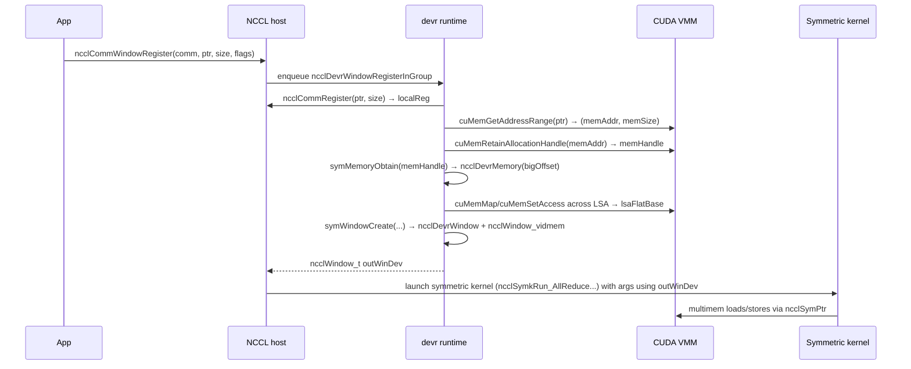
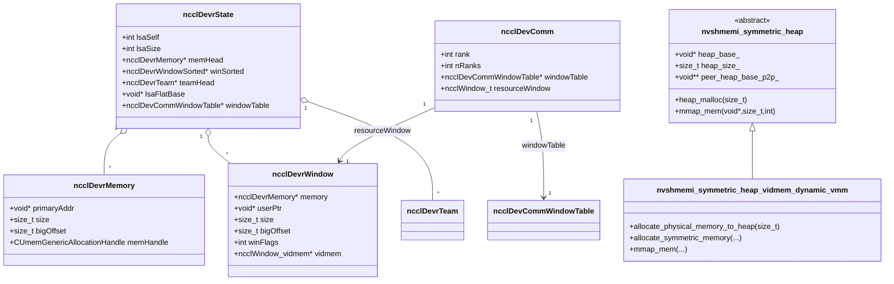

# Symmetric Memory in NCCL vs NVSHMEM

This document compares NCCL’s VMM‑based symmetric memory runtime (`devr`) with NVSHMEM’s symmetric heap. The focus is on implementation details, CUDA / systems primitives, and which collective algorithms (especially all‑to‑all) are enabled by each design.

All paths and links are relative to this file.

---

## 0. Quick Reference

### 0.1 Key Files

**NCCL symmetric memory (`devr`)**

- Symmetric runtime API and state  
  - [Runtime header (`ncclDevrState`, `ncclDevrWindow`, APIs)](../thirdparty/nccl/src/include/dev_runtime.h#L16)  
  - [Runtime implementation (`symMemory*`, `symWindow*`, `ncclDevrCommCreateInternal`)](../thirdparty/nccl/src/dev_runtime.cc#L145)  
- Symmetric kernels and scheduler  
  - [Symmetric scheduler (`ncclMakeSymmetricTaskList`, `ncclSymmetricTaskScheduler`)](../thirdparty/nccl/src/scheduler/symmetric_sched.cc#L12)  
  - [Symmetric AllReduce kernel](../thirdparty/nccl/src/device/symmetric/all_reduce.cuh#L257)  
  - [Symmetric pointer abstraction (`ncclSymPtr`)](../thirdparty/nccl/src/include/nccl_device/ptr.h#L14)  
- Symmetric resource / all‑to‑all primitive  
  - [Device communicator (`ncclDevComm`, `windowTable`, `resourceWindow`)](../thirdparty/nccl/src/include/nccl_device/impl/comm__types.h#L56)  
  - [Low‑latency all‑to‑all device session (`ncclLLA2ASession`)](../thirdparty/nccl/src/include/nccl_device/ll_a2a.h#L14)  
  - [LL‑A2A implementation (`send`, `recv`, `recvReduce`)](../thirdparty/nccl/src/include/nccl_device/impl/ll_a2a__funcs.h#L16)  

**NVSHMEM symmetric heap**

- Symmetric heap abstractions  
  - [Host symmetric heap classes (`nvshmemi_symmetric_heap*`)](../thirdparty/nvshmem/src/include/internal/host/nvshmemi_symmetric_heap.hpp#L38)  
  - [Dynamic vidmem VMM heap (`nvshmemi_symmetric_heap_vidmem_dynamic_vmm`)](../thirdparty/nvshmem/src/include/internal/host/nvshmemi_symmetric_heap.hpp#L493)  
  - [Device‑visible state (`heap_base`, `heap_size`, `peer_heap_base_*`)](../thirdparty/nvshmem/src/include/device_host/nvshmem_types.h#L456)  
- Heap APIs and pointer helpers  
  - [Symmetric allocation (`nvshmem_malloc`, `nvshmem_calloc`, `nvshmem_align`, `nvshmem_free`)](../thirdparty/nvshmem/src/host/mem/mem_heap.cpp#L2293)  
  - [PE‑local pointer and multicast pointer (`nvshmem_ptr`, `nvshmemx_mc_ptr`)](../thirdparty/nvshmem/src/host/mem/mem_heap.cpp#L2390)  
  - [User buffer registration / unregistration (`nvshmemx_buffer_register_symmetric`)](../thirdparty/nvshmem/src/host/mem/mem_heap.cpp#L2423)  
- Heap VMM / NVLS integration  
  - [Allocate VMM backing for heap (`allocate_physical_memory_to_heap`)](../thirdparty/nvshmem/src/host/mem/mem_heap.cpp#L1734)  
  - [Allocate symmetric memory in VMM heap (`allocate_symmetric_memory`)](../thirdparty/nvshmem/src/host/mem/mem_heap.cpp#L1819)  
  - [Map user buffers into heap (`mmap_mem` for VMM heap)](../thirdparty/nvshmem/src/host/mem/mem_heap.cpp#L1842)  
  - [Unmap registered user buffers (`unmap_mem`)](../thirdparty/nvshmem/src/host/mem/mem_heap.cpp#L1994)  
- Device collectives & multicast primitives  
  - [Multimem multicast store helpers (`nvshmemi_mcast*_store_threadgroup`)](../thirdparty/nvshmem/src/include/non_abi/device/common/nvshmemi_common_device.cuh#L155)  
  - [Device collectives entrypoints](../thirdparty/nvshmem/src/include/internal/non_abi/nvshmemi_h_to_d_coll_defs.cuh#L66)  

### 0.2 Key Functions Index

| Function / Type | File | Purpose |
|-----------------|------|---------|
| `ncclDevrState` | `../thirdparty/nccl/src/include/dev_runtime.h#L46` | Per‑communicator symmetric runtime state (LSA team, memory and window lists, window table). |
| `ncclDevrWindowRegisterInGroup` | `../thirdparty/nccl/src/dev_runtime.cc#L578` | Register a user buffer as an NCCL window; builds VMM mappings and device window metadata. |
| `ncclDevrCommCreateInternal` | `../thirdparty/nccl/src/dev_runtime.cc#L709` | Build device `ncclDevComm` with window table, resource window, LSA / GIN state. |
| `ncclSymkRun_AllReduce_RSxLD_AGxST` | `../thirdparty/nccl/src/device/symmetric/all_reduce.cuh#L257` | Representative symmetric AllReduce kernel using `ncclSymPtr` and LSA barrier. |
| `ncclLLA2ASession<Coop>::send/recv` | `../thirdparty/nccl/src/include/nccl_device/impl/ll_a2a__funcs.h#L16` | Device all‑to‑all messaging primitive over a symmetric resource window. |
| `nvshmemi_symmetric_heap` | `../thirdparty/nvshmem/src/include/internal/host/nvshmemi_symmetric_heap.hpp#L50` | Base class for NVSHMEM symmetric heap implementations (sysmem, vidmem, VMM). |
| `nvshmemi_symmetric_heap_vidmem_dynamic_vmm::allocate_physical_memory_to_heap` | `../thirdparty/nvshmem/src/host/mem/mem_heap.cpp#L1734` | Allocate and map new GPU VMM backing for the symmetric heap and bind with NVLS. |
| `nvshmemi_symmetric_heap_vidmem_dynamic_vmm::mmap_mem` | `../thirdparty/nvshmem/src/host/mem/mem_heap.cpp#L1842` | Map an external user buffer into the symmetric heap address range. |
| `nvshmem_malloc` / `nvshmem_free` | `../thirdparty/nvshmem/src/host/mem/mem_heap.cpp#L2293` | Public symmetric allocation API that calls into the heap object and executes a global barrier. |
| `nvshmemi_alltoall_on_stream` | `../thirdparty/nvshmem/src/host/coll/alltoall/alltoall.h#L23` | All‑to‑all dispatcher: chooses NCCL, CE (copy‑engine) path, or NVSHMEM device kernel. |

---

## 1. What “Symmetric Memory” Means Here

At a high level, both NCCL and NVSHMEM expose *symmetric* memory but in different ways:

- **NCCL** exposes *symmetric windows* around user buffers via the `devr` runtime:
  - Applications (or higher‑level runtimes like NCCLX) call `ncclCommWindowRegister` / `ncclDevrWindowRegisterInGroup` to wrap existing device buffers in a symmetric window.
  - The runtime uses CUDA VMM (`cuMem*`) to build a **flat virtual address space** across a local‑set‑of‑addresses (LSA) team of ranks and optionally NVLS multicast mappings.
  - Device kernels see these windows via `ncclSymPtr<T>` and can issue loads/stores to any rank’s slice, or to a multicast address for NVLS.

- **NVSHMEM** exposes a *symmetric heap*:
  - All PEs allocate from a logically identical heap via `nvshmem_malloc` / `nvshmem_calloc` / `nvshmem_align`.
  - The heap object (`nvshmemi_symmetric_heap` and subclasses) arranges for each PE to have a consistent **heap base + size** and exchanges transport handles so each PE can address other PEs’ heap segments.
  - Device code uses the same virtual address for a symmetric object on every PE, and helpers like `nvshmem_ptr` and internal device state (`nvshmemi_device_state_d.heap_base`) compute remote pointers.

The rest of this document zooms into:

- How NCCL `devr` builds symmetric windows and enables symmetric kernels / `ll_a2a`.
- How NVSHMEM’s symmetric heap and optional VMM‑based implementation work.
- How these designs impact all‑to‑all, latency, throughput, and SM vs copy‑engine usage.

---

## 2. NCCL Symmetric Memory (`devr`)

### 2.1 Architecture: `ncclDevrState`, windows, and teams

The symmetric runtime is defined in [dev_runtime.h](../thirdparty/nccl/src/include/dev_runtime.h#L16):

```cpp
// ncclDevr[_]: runtime implements for symmetric API.
struct ncclDevrMemory;
struct ncclDevrWindow {
  struct ncclDevrMemory* memory;
  void*   userPtr;
  size_t  size;
  size_t  bigOffset;   // Offset in big VA space.
  int     winFlags;
  void*   localRegHandle;
  struct ncclWindow_vidmem* vidmem;
};

struct ncclDevrState {
  int   lsaSelf, lsaSize;
  int*  lsaRankList;

  size_t granularity;          // cuMem allocation granularity
  bool   ginEnabled;
  struct ncclDevrMemory*     memHead;
  struct ncclDevrWindowSorted* winSorted;
  int   winSortedCapacity, winSortedCount;
  struct ncclDevrTeam*       teamHead;
  size_t bigSize;             // size of logical VA segment per LSA rank
  struct ncclSpace bigSpace;  // allocator for the big VA space
  void* lsaFlatBase;          // concat of [lsaSize] bigSize regions
  struct ncclShadowPool shadows;
  struct ncclDevCommWindowTable* windowTable;

  ncclIntruQueue<ncclDevrRegTask, &ncclDevrRegTask::next>       regTaskQueue;
  ncclIntruQueue<ncclDevrCommCreateTask, &ncclDevrCommCreateTask::next> commCreateTaskQueue;
};
```

Key ideas:

- **LSA team** (`lsaSelf`, `lsaSize`, `lsaRankList`): a dense subset of ranks (often intra‑node) for which the runtime builds a flat VMM mapping. If topology is irregular, NCCL falls back to a singleton team.
- **Big VA space**: for each LSA rank, the runtime reserves a `bigSize`‑sized virtual region; all ranks’ regions are concatenated starting at `lsaFlatBase`. Each registered `ncclDevrMemory` gets a `bigOffset` into this space.
- **Windows**:
  - `ncclDevrMemory` tracks a physical allocation handle and its size.
  - `ncclDevrWindow` represents a *sub‑range* of that memory exposed as a symmetric window (user pointer + size + flags).
  - `winSorted` is a sorted array by `userAddr` so the scheduler can map `sendbuff` / `recvbuff` back to windows quickly.
- **Device view**:
  - `windowTable` is a linked list of `ncclDevCommWindowTable` structs stored in device memory and referenced from `ncclDevComm`.  
  - Each entry contains a `[base, size, window]` triple so device code can find the window that covers a given user pointer.

### 2.2 Mapping a buffer into a symmetric window

The work‑horse registration function is [`ncclDevrWindowRegisterInGroup`](../thirdparty/nccl/src/dev_runtime.cc#L578). It is invoked by the group API wrapper `ncclCommWindowRegister`.

**Group API wrapper** – [`dev_runtime.cc`](../thirdparty/nccl/src/dev_runtime.cc#L890):

```cpp
ncclResult_t ncclCommWindowRegister(
    ncclComm* comm, void* userPtr, size_t userSize,
    ncclWindow_vidmem** outWinDev, int winFlags) {
  ncclResult_t ret = ncclSuccess;
  int saveDev;
  ncclDevrRegTask* task;

  cudaGetDevice(&saveDev);
  ncclGroupStartInternal();

  if (userPtr == nullptr || userSize == 0 ||
      !(comm->symmetricSupport || ncclParamLocalRegister())) goto exit;

  NCCLCHECKGOTO(ncclCommEnsureReady(comm), ret, fail);
  cudaSetDevice(comm->cudaDev);

  NCCLCHECKGOTO(ncclDevrInitOnce(comm), ret, fail);

  NCCLCHECKGOTO(ncclCalloc(&task, 1), ret, fail);
  task->userPtr   = userPtr;
  task->userSize  = userSize;
  task->winFlags  = winFlags;
  task->outWinDev = outWinDev;
  ncclIntruQueueEnqueue(&comm->devrState.regTaskQueue, task);
  ncclGroupCommJoin(comm, ncclGroupTaskTypeSymRegister);
```

Frame‑by‑frame:

1. The caller (e.g., NCCLX) enters a **group** and enqueues a registration task per communicator rank.
2. `ncclDevrInitOnce` ensures `ncclDevrState` is initialized (LSA team, `bigSize`, shadow pools, etc.).
3. A background registration worker eventually calls `ncclDevrWindowRegisterInGroup` with the task arguments.

**Window registration worker** – [`dev_runtime.cc`](../thirdparty/nccl/src/dev_runtime.cc#L578):

```cpp
ncclResult_t ncclDevrWindowRegisterInGroup(
    ncclComm* comm, void* userPtr, size_t userSize,
    int winFlags, ncclWindow_t* outWinDev) {
  CUdeviceptr memAddr = 0;
  size_t memSize = 0;
  CUmemGenericAllocationHandle memHandle = 0;
  size_t memOffset;
  ncclDevrMemory* mem = nullptr;
  cudaStream_t stream = nullptr;
  void* localRegHandle = nullptr;

  NCCLCHECKGOTO(ncclCommRegister(comm, userPtr, userSize, &localRegHandle), ret, fail);

  if (!comm->symmetricSupport) {
    *outWinDev = (ncclWindow_vidmem*)localRegHandle;
    return ncclSuccess;
  }
  if (winFlags & NCCL_WIN_COLL_SYMMETRIC) {
    NCCLCHECKGOTO(ncclSymkInitOnce(comm), ret, fail);
  }

  CUCHECKGOTO(cuMemGetAddressRange(&memAddr, &memSize, (CUdeviceptr)userPtr), ret, fail_locReg);
  memOffset = (CUdeviceptr)userPtr - memAddr;
  if (memOffset % NCCL_WIN_REQUIRED_ALIGNMENT != 0) { ... }

  CUCHECKGOTO(cuMemRetainAllocationHandle(&memHandle, (void*)memAddr), ret, fail_locReg);

  NCCLCHECKGOTO(symMemoryObtain(comm, memHandle, (void*)memAddr, memSize, &mem), ret, fail_locReg_memHandle);
  memHandle = 0;

  cudaStreamCreateWithFlags(&stream, cudaStreamNonBlocking);

  NCCLCHECKGOTO(symWindowCreate(
      comm, mem, memOffset, userPtr, userSize, winFlags,
      localRegHandle, outWinDev, nullptr, stream), ret, fail_locReg_memHandle_mem_stream);
  ...
  cudaStreamSynchronize(stream);
  NCCLCHECKGOTO(bootstrapBarrier(comm->bootstrap, comm->rank, comm->nRanks, 0xbeef), ret, ...);
```

Line‑by‑line reasoning:

- **Local registration**: `ncclCommRegister` sets up standard NCCL transport registrations (net/NVLS/IPCs) and returns a `localRegHandle`. If `symmetricSupport` is disabled, this handle *is* the window; the symmetric machinery is bypassed.
- **Symmetric‑kernel flag**: if `NCCL_WIN_COLL_SYMMETRIC` is set, the runtime lazily initializes the symmetric‑kernel state (`ncclSymkInitOnce`) so device‑initiated collectives become eligible.
- **VMM handle discovery**:
  - `cuMemGetAddressRange` finds the base address / size of the underlying allocation, ensuring the user buffer lies in a single physical segment.
  - `cuMemRetainAllocationHandle` turns that allocation into a shareable VMM handle (`memHandle`).
- **Memory object**: `symMemoryObtain` either finds an existing `ncclDevrMemory` with the same `memHandle` or allocates a new one, assigns a `bigOffset` in the flat VA, and *maps the handle for all LSA ranks* (next section).
- **Window creation**: `symWindowCreate` creates a host window object and a mirrored device struct (`ncclWindow_vidmem`), inserts the window into `windowTable`, and records it in `winSorted`.
- **Synchronization**: a non‑blocking stream executes the GPU‑side metadata copies; a `bootstrapBarrier` ensures all ranks mapped each other’s memory before returning to the user.

### 2.3 Building the flat VA for the LSA team (VMM) and NVLS multicast

When a new allocation handle is first seen, `symMemoryObtain` maps that handle into the big VA space for every LSA rank. The heavy lifting is done by [`symMemoryMapLsaTeam`](../thirdparty/nccl/src/dev_runtime.cc#L147):

```cpp
static ncclResult_t symMemoryMapLsaTeam(
    ncclComm* comm, CUmemGenericAllocationHandle memHandle,
    size_t size, size_t bigOffset) {
  ncclDevrState* devr = &comm->devrState;
  CUmemAccessDesc accessDesc = {};
  union Message { CUmemGenericAllocationHandle memHandle;
                  CUmemFabricHandle  fabricHandle; };

  Message* messages = (Message*)calloc(devr->lsaSize, sizeof(Message));
  if (ncclCuMemHandleType == CU_MEM_HANDLE_TYPE_POSIX_FILE_DESCRIPTOR) {
    messages[devr->lsaSelf].memHandle = memHandle;
  } else {
    cuMemExportToShareableHandle(&messages[devr->lsaSelf].fabricHandle,
                                 memHandle, ncclCuMemHandleType, 0);
  }

  bootstrapIntraNodeAllGather(comm->bootstrap, devr->lsaRankList,
      devr->lsaSelf, devr->lsaSize, messages, sizeof(Message));

  if (devr->lsaFlatBase == nullptr) {
    CUdeviceptr addr;
    cuMemAddressReserve(&addr, devr->lsaSize * devr->bigSize,
                        NCCL_MAX_PAGE_SIZE, 0, 0);
    devr->lsaFlatBase = (void*)addr;
  }
  accessDesc.location.type = CU_MEM_LOCATION_TYPE_DEVICE;
  accessDesc.location.id   = comm->cudaDev;
  accessDesc.flags         = CU_MEM_ACCESS_FLAGS_PROT_READWRITE;

  for (int r = 0; r < devr->lsaSize; r++) {
    CUmemGenericAllocationHandle impHandle;
    if (r == devr->lsaSelf) impHandle = memHandle;
    else {
      ... cuMemImportFromShareableHandle(&impHandle, ...) ...
    }
    CUdeviceptr addr = (CUdeviceptr)((char*)devr->lsaFlatBase
                       + r * devr->bigSize + bigOffset);
    cuMemMap(addr, size, 0, impHandle, 0);
    cuMemSetAccess(addr, size, &accessDesc, 1);
    if (r != devr->lsaSelf) cuMemRelease(impHandle);
  }
  bootstrapIntraNodeBarrier(comm->bootstrap, devr->lsaRankList,
                            devr->lsaSelf, devr->lsaSize, 0xbeef);
}
```

Interpretation:

- Each rank contributes its shareable handle (`memHandle` or `fabricHandle`) via an **intra‑node all‑gather**, so every rank knows how to import every other rank’s backing allocation.
- NCCL reserves a *single flat virtual region* of size `lsaSize * bigSize` and maps each rank’s handle into the slice `[r * bigSize + bigOffset, ...)`.
- On each rank, the same logical `(lsaRank, bigOffset)` maps to the same logical object, enabling device code to compute remote pointers via simple arithmetic using `devr->lsaFlatBase`, `bigSize`, and `bigOffset`.

Multicast (NVLS) support is wired via `symTeamObtain` and `symBindTeamMemory`:

- `symTeamObtain` ([`dev_runtime.cc#L229`](../thirdparty/nccl/src/dev_runtime.cc#L229)) ensures a `ncclDevrTeam` exists for a given `ncclTeam`, optionally creating:
  - An NVLS multicast object via `ncclNvlsGroupCreate` / `ncclNvlsGroupConnect`.
  - A device VA range reserved and mapped with `cuMulticastAddDevice` + `cuMemMap`.
- `symBindTeamMemory` ([`dev_runtime.cc#L205`](../thirdparty/nccl/src/dev_runtime.cc#L205)) then binds each `ncclDevrMemory` into that multicast object using `cuMulticastBindMem`.

Host‑side helpers `ncclDevrGetLsaRankPtr` and `ncclDevrGetLsaTeamPtrMC` ([`dev_runtime.cc#L1024`](../thirdparty/nccl/src/dev_runtime.cc#L1024)) expose these addresses:

```cpp
ncclResult_t ncclDevrGetLsaRankPtr(
    ncclComm* comm, ncclDevrWindow* winHost,
    size_t offset, int lsaRank, void** outPtr) {
  ncclDevrState* devr = &comm->devrState;
  *outPtr = (void*)((uintptr_t)devr->lsaFlatBase
           + lsaRank * devr->bigSize + winHost->bigOffset + offset);
}

ncclResult_t ncclDevrGetLsaTeamPtrMC(
    ncclComm* comm, ncclDevrWindow* winHost,
    size_t offset, ncclTeam lsaTeam, void** outPtr) {
  ncclDevrTeam* tm;
  symTeamObtain(comm, lsaTeam, /*multimem=*/true, &tm);
  *outPtr = (void*)((uintptr_t)tm->mcBasePtr + winHost->bigOffset + offset);
}
```

These are the host‑side mirror of what `ncclSymPtr` does on the device.

### 2.4 Device view: `ncclDevComm`, window table, and `ncclSymPtr`

When a device communicator is constructed (e.g., for symmetric kernels or device‑initiated operations), NCCL calls [`ncclDevrCommCreateInternal`](../thirdparty/nccl/src/dev_runtime.cc#L709):

```cpp
ncclResult_t ncclDevrCommCreateInternal(
    ncclComm* comm,
    ncclDevCommRequirements const* reqs,
    ncclDevComm* outDevComm) {
  ncclDevrState* devr = &comm->devrState;
  ncclTeam world = ncclTeamWorld(comm);
  ncclTeam lsa   = ncclTeamInnerFactor(world, devr->lsaSize);
  ...
  memset(outDevComm, 0, sizeof(*outDevComm));
  outDevComm->rank   = comm->rank;
  outDevComm->nRanks = comm->nRanks;
  outDevComm->lsaRank = devr->lsaSelf;
  outDevComm->lsaSize = devr->lsaSize;
  ...
  symTeamObtain(comm, lsa, /*multicast=*/reqs->lsaMultimem, &tmLsa);
  outDevComm->lsaMultimem.mcBasePtr = tmLsa->mcBasePtr;
  ...
  symWindowTableInitOnce(comm, stream);
  outDevComm->windowTable = devr->windowTable;
  ...
  if (bufSizeTotal != 0) {
    cuMemCreate(&memHandle, bufSizeTotal, &memProp, 0);
    symMemoryObtain(comm, memHandle, NULL, bufSizeTotal, &mem);
    symWindowCreate(comm, mem, 0, nullptr, bufSizeTotal, 0,
                    nullptr, &outDevComm->resourceWindow, &win, stream);
    ncclShadowPoolToHost(&devr->shadows, win->vidmem, &winHost);
    outDevComm->resourceWindow_inlined = *winHost;
    outDevComm->ginSignalShadows =
      (uint64_t*)add4G((char*)winHost->lsaFlatBase + ginSignalShadowsOffset,
                       winHost->lsaRank * winHost->stride4G);
  }
  ...
  bootstrapBarrier(comm->bootstrap, comm->rank, comm->nRanks, 0xbeef);
}
```

Important pieces:

- `windowTable` is made available to device code via `ncclDevComm::windowTable`. Symmetric kernels use this table to turn user pointers into `ncclWindow_t` handles in device code.
- `resourceWindow` is an internal symmetric window used for **auxiliary state** (e.g., `ll_a2a` buffers, GIN signals/counters).
- `lsaMultimem` stores the multicast base pointer for NVLS operations.

On the device, the symmetric pointer abstraction is [`ncclSymPtr`](../thirdparty/nccl/src/include/nccl_device/ptr.h#L14):

```cpp
template<typename T>
struct ncclSymPtr {
  using ElementType = T;
  ncclWindow_t window;
  size_t       offset;

  NCCL_HOST_DEVICE_INLINE constexpr
  ncclSymPtr(ncclWindow_t window=nullptr, size_t offset=0);

  template<typename U>
  NCCL_HOST_DEVICE_INLINE operator ncclSymPtr<U>() const { return {window, offset}; }

  // + / - advance the offset in units of T
  NCCL_HOST_DEVICE_INLINE ncclSymPtr<T>& operator+=(int d) {
    offset = (size_t)((T*)offset + d);
    return *this;
  }
  ...
  #if __CUDACC__
  NCCL_DEVICE_INLINE T* localPtr() const;
  NCCL_DEVICE_INLINE T* lsaPtr(int peer) const;
  NCCL_DEVICE_INLINE T* peerPtr(ncclTeam team, int peer) const;
  NCCL_DEVICE_INLINE T* multimemPtr(ncclMultimemHandle mmHandle) const;
  #endif
};
```

`ncclSymPtr` combines:

- A **window handle** pointing into `windowTable`.
- An **offset** relative to the start of that window.

The device‐side `localPtr` / `lsaPtr` / `peerPtr` methods (implemented in `impl/ptr__funcs.h`) dereference the window into concrete device pointers using the `ncclWindow_vidmem` metadata (`lsaFlatBase`, `stride4G`, multicast base, GIN handles).

In symmetric kernels, work descriptors store windows and offsets; kernels cast into `ncclSymPtr<T>` to read and write arbitrary ranks’ portions of a window.

### 2.5 Symmetric kernels and all‑to‑all via `ll_a2a`

#### 2.5.1 Symmetric AllReduce example

A representative symmetric AllReduce kernel is [`ncclSymkRun_AllReduce_RSxLD_AGxST`](../thirdparty/nccl/src/device/symmetric/all_reduce.cuh#L257):

```cpp
template<template<typename> typename Red, typename T>
__device__ __forceinline__
void ncclSymkRun_AllReduce_RSxLD_AGxST(ncclSymkDevWorkArgs const* args) {
  ncclSymkArgsHandler handler{args};
  ncclLsaBarrierSession<ncclCoopCta> bar{
    ncclCoopCta(), handler.comm, ncclTeamTagLsa(), blockIdx.x
  };

  Red<typename ncclSymkAccumType<Red,T,false>::Type> red(handler.devWork->redOpArg);
  int const& rank   = handler.comm.rank;
  int const& nRanks = handler.comm.nRanks;

  bar.arrive(ncclCoopCta(), cuda::memory_order_relaxed);

  bool waitNeeded = true;
  handler.forEachWork<T>(
      [&] __device__(int block, int nBlocks, size_t nElts, size_t nAllElts,
                     ncclSymPtr<T> input, ncclSymPtr<T> output) {
        int gt  = flattenIx(threadIdx.x%WARP_SIZE, WARP_SIZE,
                            rank, nRanks,
                            block, nBlocks,
                            threadIdx.x/WARP_SIZE, blockDim.x/WARP_SIZE);
        int gtn = nRanks * nBlocks * blockDim.x;
        allreduce(handler, gtn, gt, nBlocks, waitNeeded, bar, red, input, output, nElts);
        waitNeeded = false;
      });

  bar.sync(ncclCoopCta(), cuda::memory_order_release);
}
```

Execution outline:

- `handler.forEachWork` iterates over symmetric tasks; each task carries *symmetric input and output windows* expressed as `ncclSymPtr<T>`.
- Threads are numbered globally (`gt`, `gtn`) across ranks and blocks, so the workload can be evenly striped over the LSA team.
- `allreduce(...)` uses `ncclSymPtr` to:
  - Perform **multimem loads** from all peers’ symmetric slices when NVLS is available.
  - Or perform point‑to‑point symmetric loads/stores across ranks otherwise.
- Synchronization across ranks is via an **LSA barrier** (`ncclLsaBarrierSession`) implemented in device code, not host.

Supported symmetric collectives (as of this NCCL snapshot) include AllReduce, AllGather, and ReduceScatter (`device/symmetric/*.cuh`). There is no dedicated symmetric AllToAll kernel; instead NCCL exposes a more general all‑to‑all *messaging* primitive.

#### 2.5.2 `ll_a2a`: device all‑to‑all messaging over a resource window

The low‑latency all‑to‑all primitive is defined in [`ll_a2a.h`](../thirdparty/nccl/src/include/nccl_device/ll_a2a.h#L14) and implemented in [`ll_a2a__funcs.h`](../thirdparty/nccl/src/include/nccl_device/impl/ll_a2a__funcs.h#L16).

At host level, [`ncclLLA2ACreateRequirement`](../thirdparty/nccl/src/nccl_device/ll_a2a.cc#L12) defines how much **resource window** space is needed:

```cpp
ncclResult_t ncclLLA2ACreateRequirement(
    int nBlocks, int nSlots,
    ncclLLA2AHandle_t* outHandle,
    ncclDevResourceRequirements_t* outReq) {
  outHandle->nSlots = nSlots;
  memset(outReq, 0, sizeof(*outReq));
  outReq->bufferSize    = nBlocks * (1 + 2 * nSlots) * 16;
  outReq->bufferAlign   = 16;
  outReq->outBufferHandle = &outHandle->bufHandle;
  return ncclSuccess;
}
```

`ncclDevCommCreateInternal` satisfies this requirement by carving space inside `resourceWindow` and recording a `bufHandle`. On the device, `ncclLLA2ASession` uses that handle:

```cpp
template<typename Coop>
NCCL_DEVICE_INLINE
ncclLLA2ASession<Coop>::ncclLLA2ASession(
    Coop coop, ncclDevComm const& comm, ncclTeam team,
    ncclLLA2AHandle handle, uint32_t block, int maxElts,
    bool multimem, ncclMultimemHandle mmHandle)
  : ncclLLA2ASession_internal<Coop>{
      coop, comm, team, handle, (int)block, maxElts,
      multimem, mmHandle, /*epoch=*/0, /*slotsOffset=*/0 } {
  uint4* line = (uint4*)ncclGetResourceBufferLocalPointer(comm, handle.bufHandle);
  line += block * (1 + 2 * handle.nSlots);
  this->epoch      = line->x + 2;
  this->slotsOffset = this->calcSlotOffset();
}

template<typename Coop>
template<typename T>
NCCL_DEVICE_INLINE void
ncclLLA2ASession<Coop>::send(int peer, int elt, T data) {
  union { T tmp; uint32_t u32[/*…*/][2]; };
  tmp = data;
  uint4* buf = (uint4*)ncclGetResourceBufferPeerPointer(
      this->comm, this->handle.bufHandle, this->team, peer);
  buf += this->slotsOffset + elt;
  #pragma unroll
  for (int u = 0; u < divUp(sizeof(T), 8); u++) {
    asm volatile("st.volatile.v4.u32 [%0],{%1,%3,%2,%3};" ::
      "l"(buf + u * this->pitch),
      "r"(u32[u][0]), "r"(u32[u][1]), "r"(this->epoch));
  }
}
```

Behavior:

- `ncclGetResourceBufferLocalPointer` and `PeerPointer` each return a *symmetric pointer* inside `resourceWindow_inlined.lsaFlatBase` via `ncclSymPtr<char>`.
- Each slot is a 16‑byte quad (`uint4`) storing payload and epoch metadata. `send()` writes slots for every peer; `recv()` polls until epochs match.
- An all‑to‑all exchange is structured into epochs via `endEpoch()`, which zeroes slots and increments the epoch counter.

This primitive is used by higher‑level code (e.g., CE all‑to‑all paths in NCCLX) to implement GPU‑resident all‑to‑all algorithms over a symmetric buffer, without requiring new host collectives.

### 2.6 CUDA and systems primitives used by NCCL’s symmetric runtime

NCCL’s symmetric memory relies on:

- **CUDA VMM / cuMem APIs** (both P2P and symmetric runtime):  
  - `cuMemAddressReserve`, `cuMemMap`, `cuMemSetAccess` for mapping allocations into the flat LSA VA space and multicast objects.  
  - `cuMemExportToShareableHandle`, `cuMemImportFromShareableHandle`, `cuMemRetainAllocationHandle`, `cuMemRelease` for inter‑process sharing of GPU allocations.  
  - `cuMulticastAddDevice`, `cuMulticastBindMem`, `cuMulticastUnbind` for NVLS multicast memory.
- **Bootstrap collectives**:  
  - `bootstrapIntraNodeAllGather` and `bootstrapIntraNodeBarrier` to exchange handles and synchronize mapping.
- **CUDA streams and async copies**:  
  - A temporary non‑blocking stream is used to install or tear down window metadata on the device via `cudaMemcpyAsync` and `cudaMemsetAsync`.
- **Cooperative kernels and symmetric kernel scheduler**:  
  - Symmetric kernels are launched as cooperative kernels with per‑channel tuning via `ncclSymkPickKernel` and `ncclSymmetricTaskScheduler` ([`symmetric_sched.cc`](../thirdparty/nccl/src/scheduler/symmetric_sched.cc#L12)).

---

## 3. NVSHMEM Symmetric Heap

### 3.1 Architecture: heap object, heap kinds, and device state

NVSHMEM’s symmetric heap is built around the hierarchy sketched in `nvshmemi_symmetric_heap.hpp`:

```cpp
// Supported memory kinds: sysmem (linux shm), vidmem (cudaMalloc), vidmem (cuMemCreate)
//                         nvshmemi_symmetric_heap
//           -----------------------------------------------
//         |                                               |
//  nvshmemi_symmetric_heap_static             nvshmemi_symmetric_heap_dynamic
//      |                    |                                |
//  sysmem_static        vidmem_static                  vidmem_dynamic (VMM)
```

The base class [definition](../thirdparty/nvshmem/src/include/internal/host/nvshmemi_symmetric_heap.hpp#L50):

```cpp
class nvshmemi_symmetric_heap {
  public:
    explicit nvshmemi_symmetric_heap(nvshmemi_state_t *state) noexcept : state_(state) {}
    virtual ~nvshmemi_symmetric_heap();

    size_t get_mem_granularity() const { return mem_granularity_; }
    uint64_t get_logical_heap_size() const { return heap_size_; }
    CUmemAllocationHandleType get_mem_handle_type(void) { return mem_handle_type_; }
    ...
    // Top-level public facing functions
    virtual void *heap_malloc(size_t size);
    virtual void *heap_calloc(size_t size, size_t count);
    virtual void *heap_align(size_t size, size_t alignment);
    virtual void  heap_deallocate(void *ptr);

    // Map/unmap user buffers into the heap ("external allocations")
    virtual void *mmap_mem(void *ptr, size_t size, int flags) = 0;
    virtual int   unmap_mem(void *ptr, size_t size) = 0;

    // NVLS-specific operations (implemented only in dynamic vidmem heaps)
    virtual int nvls_create_heap_memory_by_team(nvshmemi_team_t *team) = 0;
    virtual int nvls_bind_heap_memory_by_team(nvshmemi_team_t *team)   = 0;
    virtual int nvls_map_heap_memory_by_team(nvshmemi_team_t *team)    = 0;
    ...
  protected:
    virtual void *allocate_symmetric_memory(size_t size, size_t count,
                                            size_t alignment, int type) = 0;
    virtual int   setup_mspace() = 0;
    ...
    void *heap_base_ = nullptr;
    void **peer_heap_base_p2p_    = nullptr;
    void **peer_heap_base_remote_ = nullptr;
    size_t heap_size_ = 0;
    ...
};
```

Key pieces:

- The **heap object** lives on the host as `nvshmemi_state->heap_obj`. Different subclasses implement:
  - `nvshmemi_symmetric_heap_sysmem_static_shm` for shared‑memory sysmem heaps.
  - `nvshmemi_symmetric_heap_vidmem_static_pinned` for static `cudaMalloc` heap.
  - `nvshmemi_symmetric_heap_vidmem_dynamic_vmm` for dynamic, VMM‑backed GPU heaps (most interesting for GPU‑only symmetric memory and NVLS).
- Each heap manages:
  - `heap_base_` / `heap_size_`: the symmetric address range.
  - `peer_heap_base_p2p_` / `peer_heap_base_remote_`: per‑PE base pointers used by transports (P2P vs remote).
  - `remote_handles_` / `p2p_handles_`: arrays of transport‑specific memory handles used for GPUDirect access.

On the device, *host state is mirrored* into `nvshmemi_device_state_d` whose host‑visible layout (`nvshmemi_device_host_state_t`) includes:

```cpp
struct nvshmemi_device_host_state_v1 {
  ...
  void *heap_base;
  size_t heap_size;
  void **peer_heap_base_p2p;
  void **peer_heap_base_remote;
  bool symmetric_heap_kind;
  ...
};
```

Device collectives and RMA operations use this state to compute peer addresses.

### 3.2 Symmetric allocation and pointer translation

The public symmetric allocation APIs are implemented in [`mem_heap.cpp`](../thirdparty/nvshmem/src/host/mem/mem_heap.cpp#L2293):

```cpp
void *nvshmem_malloc(size_t size) {
  void *ptr = NULL;
  NVTX_FUNC_RANGE_IN_GROUP(ALLOC);
  NVSHMEMU_THREAD_CS_ENTER();
  int ret = nvshmemi_check_state_and_init();
  if (ret) { nvshmem_error = 1; goto exit_and_return; }

  if (NVSHMEMI_IS_NO_ACTION_BY_SIZE(size)) goto exit_and_return;

  ptr = nvshmemi_state->heap_obj->heap_malloc(size);

  nvshmemi_barrier_all();
exit_and_return:
  NVSHMEMU_THREAD_CS_EXIT();
  return ptr;
}
```

Per call:

- Ensures NVSHMEM is initialized and participates in a **global barrier** to maintain symmetry: every PE must allocate the same size in the same call sequence.
- Delegates to `heap_obj->heap_malloc`, which eventually calls `allocate_symmetric_memory` on the concrete heap class (see below).

Pointer translation helpers are also in `mem_heap.cpp`:

```cpp
void *nvshmemi_ptr(const void *ptr, int pe) {
  if (pe >= 0 && pe < nvshmemi_state->npes &&
      ptr >= nvshmemi_device_state.heap_base) {
    uintptr_t offset =
      (char*)ptr - (char*)nvshmemi_device_state.heap_base;

    if (offset < nvshmemi_device_state.heap_size) {
      void *peer_addr = nvshmemi_state->heap_obj->get_local_pe_base()[pe];
      if (peer_addr != NULL) peer_addr = (void*)((char*)peer_addr + offset);
      return peer_addr;
    }
  }
  return NULL;
}

void *nvshmemx_mc_ptr(nvshmem_team_t team, const void *ptr) {
  uintptr_t offset =
    (char*)ptr - (char*)nvshmemi_device_state.heap_base;
  if (ptr >= nvshmemi_device_state.heap_base &&
      offset < nvshmemi_device_state.heap_size) {
    auto *nvls =
      (nvls::nvshmemi_nvls_rsc*)nvshmemi_team_pool[team]->nvls_rsc;
    void *mc_addr = nvls ? nvls->get_mc_base() : NULL;
    if (mc_addr != NULL) mc_addr = (void*)((char*)mc_addr + offset);
    return mc_addr;
  }
  return NULL;
}
```

Interpretation:

- All symmetric objects live inside `[heap_base, heap_base + heap_size)`.
- Given a **local pointer in the heap**, `nvshmem_ptr` computes the same offset into a peer’s heap base; `nvshmemx_mc_ptr` computes the offset into an NVLS multicast buffer.
- Device code uses similar logic via `nvshmemi_device_state_d.heap_base` / `peer_heap_base_p2p` and helpers in device headers, but the mental model is identical: **same offset, different base**.

### 3.3 VMM‑backed GPU heap and NVLS integration

For GPU‑resident symmetric heaps that can grow at runtime and exploit NVLS, NVSHMEM uses the `nvshmemi_symmetric_heap_vidmem_dynamic_vmm` subclass. Two key methods implement heap growth and symmetric allocations.

**Allocating physical VMM backing for the heap** – [`mem_heap.cpp`](../thirdparty/nvshmem/src/host/mem/mem_heap.cpp#L1734):

```cpp
int nvshmemi_symmetric_heap_vidmem_dynamic_vmm
::allocate_physical_memory_to_heap(size_t size) {
  size = ((size + mem_granularity_ - 1) / mem_granularity_) * mem_granularity_;
  CUmemGenericAllocationHandle cumem_handle;
  CUmemAllocationProp prop = {};
  CUmemAccessDesc access;
  char *buf_start;
  off_t heap_offset = 0, mmap_offset = 0;
  nvshmemi_state_t *state = get_state();
  set_cuda_mem_prop((void *)&prop, get_mem_handle_type());

  access.location.type = CU_MEM_LOCATION_TYPE_DEVICE;
  access.location.id   = state->device_id;
  access.flags         = CU_MEM_ACCESS_FLAGS_PROT_READWRITE;

  buf_start = (char*)heap_base_ + physical_internal_heap_size_;

  // create VMM allocation
  CUPFN(nvshmemi_cuda_syms, cuMemCreate(&cumem_handle, size, &prop, 0));

  heap_offset = (off_t)physical_internal_heap_size_;
  cumem_handles_.push_back(
      std::make_tuple(cumem_handle, heap_offset, mmap_offset, size, false));

  CUPFN(nvshmemi_cuda_syms,
        cuMemMap((CUdeviceptr)buf_start, size, mmap_offset, cumem_handle, 0));
  CUPFN(nvshmemi_cuda_syms,
        cuMemSetAccess((CUdeviceptr)buf_start, size, &access, 1));

  status = nvls_bind_heap_memory((nvshmem_mem_handle_t *)&cumem_handle,
                                 (off_t)heap_offset, mmap_offset, size);
  ...
  status = register_heap_memory((nvshmem_mem_handle_t *)&cumem_handle,
                                buf_start, size);
  ...
  nvshmemi_boot_handle.barrier(&nvshmemi_boot_handle);
}
```

Core steps:

- **VMM allocation** via `cuMemCreate`, sized to multiples of `mem_granularity_`.
- The allocation is mapped into the heap’s virtual range at `heap_base_ + physical_internal_heap_size_`.
- NVLS bindings are established via `nvls_bind_heap_memory`, and transport‑specific registration is done via `register_heap_memory`.
- A global bootstrap barrier ensures all PEs have imported and registered the new chunk.

**Allocating symmetric memory out of the heap** – [`mem_heap.cpp`](../thirdparty/nvshmem/src/host/mem/mem_heap.cpp#L1819):

```cpp
void *nvshmemi_symmetric_heap_vidmem_dynamic_vmm
::allocate_symmetric_memory(size_t size, size_t count,
                            size_t alignment, int type) {
  int status = 0;
  void *ptr = allocate_virtual_memory_from_mspace(size, count, alignment, type);
  if ((size > 0) && (ptr == NULL)) {
    status = allocate_physical_memory_to_heap(size + alignment);
    NVSHMEMI_NZ_ERROR_JMP(status, ...,
        "allocate_physical_memory_to_heap failed\n");
    ptr = allocate_virtual_memory_from_mspace(size, count, alignment, type);
    status = nvshmemi_update_device_state();
  }
  return ptr;
}
```

The allocation algorithm:

- First tries to carve space **virtually** out of the heap’s `mspace` (a virtual allocator).
- If there is no backing physical memory for the requested size, it calls `allocate_physical_memory_to_heap`, then repeats the virtual allocation and updates the device state (so `heap_size` / `peer_heap_base_*` remain consistent).

### 3.4 Registering user buffers into the symmetric heap

NVSHMEM also supports mapping external allocations (e.g., `cudaMalloc` tensors) into the symmetric address space via `nvshmemx_buffer_register_symmetric`:

```cpp
void *nvshmemx_buffer_register_symmetric(void *buf_ptr, size_t size, int flags) {
  NVTX_FUNC_RANGE_IN_GROUP(ALLOC);
  NVSHMEMU_THREAD_CS_ENTER();
  int ret = nvshmemi_check_state_and_init();
  if (ret) { nvshmem_error = 1; goto exit_and_return; }

  void *ptr = nvshmemi_state->heap_obj->mmap_mem(buf_ptr, size, flags);

  nvshmemi_barrier_all();
exit_and_return:
  NVSHMEMU_THREAD_CS_EXIT();
  return ptr;
}
```

For the VMM heap, `mmap_mem` is implemented in `nvshmemi_symmetric_heap_vidmem_dynamic_vmm` ([`mem_heap.cpp`](../thirdparty/nvshmem/src/host/mem/mem_heap.cpp#L1842)):

```cpp
void *nvshmemi_symmetric_heap_vidmem_dynamic_vmm
::mmap_mem(void *buf_ptr, size_t size, int flags) {
  CUmemGenericAllocationHandle userAllocHandle;
  CUmemAllocationProp prop = {};
  CUmemAccessDesc access;
  ...
  set_cuda_mem_prop((void*)&prop, get_mem_handle_type());
  status = check_user_buffer_for_mmap(buf_ptr, size, &ptr_mem_type);
  ...
  // allocate virtual space in mmap_mspace_
  void *ptr = mmap_mspace_->allocate(size);
  if (!ptr) { ... extend mmap range within heap ... }

  // track aliasing and (optionally) EGM ranges
  alias_va_map_[curr_ptr] = curr_buf_ptr;
  if (is_egm) egm_map_[curr_ptr] = register_size;
  ...
  heap_offset = (off_t)((char*)buf_start - (char*)heap_base_);
  cuMemRetainAllocationHandle(&userAllocHandle, buf_ptr);
  cumem_handles_.push_back(
    std::make_tuple(userAllocHandle, heap_offset, mmap_offset, size, false));

  cuMemMap((CUdeviceptr)buf_start, size, mmap_offset, userAllocHandle, 0);
  cuMemSetAccess((CUdeviceptr)buf_start, size, &access, 1);

  nvls_bind_heap_memory((nvshmem_mem_handle_t *)&userAllocHandle,
                        heap_offset, mmap_offset, size);

  // Register as external allocation for transports
  register_heap_memory((nvshmem_mem_handle_t *)&userAllocHandle,
                       buf_start, size, /*ext_allocation=*/true);

  nvshmemi_boot_handle.barrier(&nvshmemi_boot_handle);
  return ptr;
}
```

Summary:

- NVSHMEM obtains a VMM handle (`cuMemRetainAllocationHandle`) for the user buffer, maps it into the symmetric heap’s VA range, and registers it with transports and NVLS just like internal heap memory.
- The returned `ptr` is a **symmetric pointer** inside the heap; all PEs call the same API (with identical `size`) so the offset is consistent.
- `nvshmemx_buffer_unregister_symmetric` later calls `unmap_mem` to tear down the mappings and release remote handles.

### 3.5 Device‑side collectives and multicast stores

NVSHMEM implements device collectives over the symmetric heap using threadgroup‑oriented kernels. An important building block is the multicast store helpers in [`nvshmemi_common_device.cuh`](../thirdparty/nvshmem/src/include/non_abi/device/common/nvshmemi_common_device.cuh#L155):

```cpp
// 16‑byte multicast store
template <typename T, threadgroup_t SCOPE>
__device__ NVSHMEMI_DEVICE_ALWAYS_INLINE
void nvshmemi_mcast16_store_threadgroup(int4 *dest,
                                        const int4 *source,
                                        size_t len) {
  int myIdx    = nvshmemi_thread_id_in_threadgroup<SCOPE>();
  int groupSize = nvshmemi_threadgroup_size<SCOPE>();
  for (size_t j = myIdx * 4; j < (len / sizeof(uint32_t)); j += groupSize * 4) {
    uint32_t u4[4];
    asm("ld.global.v4.b32 {%0,%1,%2,%3}, [%4];"
        : "=r"(u4[0]), "=r"(u4[1]), "=r"(u4[2]), "=r"(u4[3])
        : "l"(source + j / 4));
    asm("multimem.st.global.v4.f32 [%0], {%1,%2,%3,%4};"
        :: "l"(dest + j / 4), "r"(u4[0]), "r"(u4[1]), "r"(u4[2]), "r"(u4[3])
        : "memory");
  }
}
```

Together with `nvshmemi_mcast8_store_threadgroup` / `nvshmemi_mcast4_store_threadgroup` and `nvshmemi_mcast_memcpy_threadgroup`, these helpers:

- Use **`multimem.st.global.*`** instructions to multicast data to NVLS multicast addresses obtained via `nvshmemx_mc_ptr`.
- Fall back to unicast store loops for any remaining unaligned tail bytes.

Host‑side collectives such as AllReduce and all‑to‑all choose between NCCL, CE copy‑engine paths, or device kernels:

- AllReduce uses `nvshmemi_reduce_on_stream` ([`rdxn.h`](../thirdparty/nvshmem/src/host/coll/rdxn/rdxn.h#L22)):
  - If NCCL is available and the op/type are supported, the call forwards to `nccl_ftable.AllReduce` on the team’s NCCL communicator.
  - Otherwise it calls a device kernel via `nvshmemi_call_rdxn_on_stream_kernel`, which uses the symmetric heap and multicast primitives.
- All‑to‑all uses `nvshmemi_alltoall_on_stream` ([`alltoall.h`](../thirdparty/nvshmem/src/host/coll/alltoall/alltoall.h#L23)):
  - First preference: NCCL send/recv group API over the team’s NCCL communicator.  
  - Second: **CE all‑to‑all** path – a host loop of `cudaMemcpyAsync` calls using `nvshmem_ptr` and synchronized with stream memops (`nvshmemi_coll_p2p_sync`).  
  - Fallback: NVSHMEM device all‑to‑all kernel launched cooperatively.

Stream memops and synchronization are implemented in [`sync.cpp`](../thirdparty/nvshmem/src/host/comm/sync.cpp#L60) and [`cpu_coll.h`](../thirdparty/nvshmem/src/host/coll/cpu_coll.h#L186):

- `nvshmemx_signal_wait_until_on_stream` uses `cuStreamWaitValue64` where available to wait on GPU‑resident flags without launching kernels.
- `nvshmemi_signal_op_on_stream` uses `cuStreamWriteValue64` or `cudaMemcpyAsync` to update remote flags.
- `nvshmemi_coll_p2p_sync` uses `nvshmemi_ptr` + `cuStreamWriteValue64` / `cuStreamWaitValue64` to synchronize a CE collective across PEs.

---

## 4. NCCL vs NVSHMEM Symmetric Memory: Comparison

### 4.1 Conceptual model and implementation differences

**NCCL (`devr`)**

- **Symmetric windows around arbitrary user buffers**:
  - You start with an existing allocation (e.g., a PyTorch tensor) and call `ncclCommWindowRegister`.
  - The runtime discovers and retains the VMM allocation handle, maps it into a flat per‑LSA virtual space, and constructs a `ncclDevrWindow`.
  - Multiple windows can share the same underlying `ncclDevrMemory` and thus the same physical allocation handle.
- **Per‑communicator runtime state**:
  - `ncclDevrState` holds the VMM mapping state, window tables, and NVLS teams.
  - Device communicators (`ncclDevComm`) embed a pointer to the window table and a private `resourceWindow` for symmetric scratch.
- **Symmetric kernels as an optimization layer**:
  - Symmetric kernels are chosen *opportunistically* when buffers lie in windows marked `NCCL_WIN_COLL_SYMMETRIC` and `ncclSymkAvailable` returns true.
  - Otherwise, NCCL falls back to classic host‑driven kernels over standard P2P / network transports.

**NVSHMEM symmetric heap**

- **Heap‑centric model**:
  - All symmetric memory comes either from `nvshmem_malloc` / `nvshmem_calloc` / `nvshmem_align` or from mapping external buffers into the heap with `nvshmemx_buffer_register_symmetric`.
  - The heap object decides how much address space and physical backing exists, and how it is distributed across PEs.
- **One heap, many backends**:
  - Sysmem (Linux shared memory), pinned GPU memory, or dynamic VMM GPU memory, selectable by configuration.
  - VMM heap integrates tightly with NVLS to allow multicast collectives on symmetric heap buffers.
- **Symmetry baked into the programming model**:
  - All symmetric objects are *implicitly* symmetric by construction; device and host APIs assume the PGAS model, with symmetric pointers and put/get semantics.
  - Collectives are expressed in terms of symmetric heap objects; NCCL is used as an implementation detail for some operations.

### 4.2 CUDA and systems primitives: side‑by‑side

| Aspect | NCCL `devr` | NVSHMEM symmetric heap |
|-------|-------------|------------------------|
| Primary abstraction | Per‑communicator symmetric windows over arbitrary user buffers | Global symmetric heap (plus optional mapped external buffers) |
| Addressing | `ncclSymPtr<T>` + window table (per `ncclDevComm`) | `heap_base` / `heap_size` + `nvshmem_ptr` / device state |
| VMM APIs | `cuMemGetAddressRange`, `cuMemRetainAllocationHandle`, `cuMemAddressReserve`, `cuMemMap`, `cuMemSetAccess` in `symMemoryMapLsaTeam` / `symMemoryObtain` | `cuMemCreate`, `cuMemMap`, `cuMemSetAccess`, `cuMemRetainAllocationHandle` in `allocate_physical_memory_to_heap` and `mmap_mem` |
| Multicast / NVLS | `cuMulticastAddDevice`, `cuMulticastBindMem`, `cuMulticastUnbind` in `symTeamObtain` / `symBindTeamMemory`; device `multimem_st_global` in symmetric kernels | NVLS resource object used by heap; `nvshmemx_mc_ptr` for multicast pointers; device multicast stores in `nvshmemi_mcast*_store_threadgroup` |
| Synchronization | Bootstrap barriers; device LSA barriers (`ncclLsaBarrierSession`); classic NCCL proxy threads for network | Global barriers in allocation / registration; stream memops (`cuStreamWriteValue64`, `cuStreamWaitValue64`) for CE collectives; device threadgroup synchronizations in NVSHMEM kernels |
| Host‑device interface | `ncclDevComm` / symmetric kernel scheduler; device kernels launched from planner | Host collectives choose between NCCL, CE (copy engine) path, and NVSHMEM device kernels; device kernels launched cooperatively via NVSHMEM launch infrastructure |

### 4.3 Algorithms and all‑to‑all: CE vs device kernels

**NCCL**

- Symmetric kernels currently implement AllReduce / AllGather / ReduceScatter using `ncclSymPtr` and LSA barriers.
- All‑to‑all is not exposed as a symmetric kernel but is supported via `ll_a2a`:
  - `ncclLLA2ACreateRequirement` encodes the amount of symmetric resource buffer needed.
  - `ncclLLA2ASession::send/recv/bcast/recvReduce` implement per‑slot messaging among ranks using volatile stores/loads in a symmetric resource window.
  - Higher‑level code (e.g., NCCLX or future NCCL APIs) can implement flexible all‑to‑all algorithms over this primitive without further host involvement.

**NVSHMEM**

- AllReduce and other reductions:
  - Option 1: call NCCL directly via `nvshmemi_reduce_on_stream` if op/datatype is supported.
  - Option 2: NVSHMEM device kernels that operate over symmetric heap buffers, using NVLS multicast where possible.
- All‑to‑all via `nvshmemi_alltoall_on_stream`:
  1. **NCCL path** – group of NCCL `Send` / `Recv` operations on the team’s communicator (host‑driven, SM‑based NCCL kernels).  
  2. **CE path (copy‑engine all‑to‑all)** – when P2P is available and stream memops are supported:
     - Host loops over peers and issues `cudaMemcpyAsync` from local source segments to remote destinations computed with `nvshmem_ptr`.  
     - `nvshmemi_coll_p2p_sync` uses `cuStreamWriteValue64` and `cuStreamWaitValue64` to coordinate completion.  
     - Data movement is primarily handled by copy engines; SMs are not occupied by dedicated kernels.  
  3. **NVSHMEM device kernels** – fallback GPU kernels using put/get and multicast primitives over the symmetric heap.

**Quantitative reasoning (complexity and resource usage)**:

- NCCL’s symmetric windows incur **per‑window** overhead:
  - One VMM handle retention and an **O(#LSA ranks)** handle exchange and mapping (all‑gather + loop in `symMemoryMapLsaTeam`).  
  - A world‑wide bootstrap barrier after `symWindowCreate`.  
  - Memory for metadata per window (host `ncclDevrWindow`, device `ncclWindow_vidmem`, entries in `windowTable` and `winSorted`).  
  For repeated use on large tensors, this one‑time cost is amortized across many symmetric collectives.
- NVSHMEM’s symmetric heap concentrates VMM cost **at heap setup and growth time**:
  - `allocate_physical_memory_to_heap` and `nvls_bind_heap_memory` are called only when the heap needs more backing memory.  
  - Individual `nvshmem_malloc` calls are mostly virtual allocator operations (`allocate_virtual_memory_from_mspace`) plus a barrier, so cost is essentially *O(1)* per allocation.
- For **all‑to‑all**, the communication cost per rank (ignoring algorithmic constants) looks similar:
  - Both CE and device paths effectively move `O(N * payload_per_peer)` data per rank.  
  - NCCL’s `ll_a2a` uses SMs to poll and write slots (busy‑waiting loops in `recvUnrolled`), while NVSHMEM’s CE all‑to‑all moves data via copy engines plus stream memops.  
  - For small messages, NCCL’s `ll_a2a` can achieve very low latency because the GPU kernel already runs and uses on‑device volatile loads; CE all‑to‑all adds host overhead per `cudaMemcpyAsync` but offloads the copy to DMA engines.
- **SM usage**:
  - NCCL symmetric kernels and `ll_a2a` are *SM‑resident*; persistent kernels occupy a configurable number of warps/blocks per rank and may consume a noticeable fraction of SM resources when active.  
  - NVSHMEM’s CE collectives use **zero‑SM** copy‑engine DMA, synchronized with stream memops; device kernels are only used when explicitly selected. This is attractive when SMs are fully utilized by compute kernels and communication can be delegated to copy engines.

### 4.4 When to prefer each approach

From a systems and performance perspective:

- **Use NCCL symmetric windows and kernels when**:
  - You already have NCCL communicators and want to accelerate repeated collectives on a small set of large user buffers.  
  - You care about tight integration with NCCL’s topology‑aware scheduling (rings / trees / NVLS) and want collectives to remain under NCCL’s tuning knobs.  
  - You’re willing to dedicate some SM capacity to persistent symmetric kernels to minimize host involvement and latency.

- **Use NVSHMEM’s symmetric heap when**:
  - Your application is GPU‑centric and naturally fits a PGAS model with one‑sided put/get plus device‑side collectives.  
  - You want a *single* symmetric abstraction for both collectives and fine‑grained RMA, with optional NCCL acceleration hidden under the hood.  
  - You want to exploit CE collectives (copy‑engine all‑to‑all, broadcast, fcollect) to overlap communication with SM‑heavy compute.

- **Hybrid cases**:
  - Many applications can layer NCCL symmetric windows *on top of* NVSHMEM or vice‑versa (e.g., using NVSHMEM to manage symmetric training state but NCCL symmetric kernels for latency‑sensitive reductions). In this repo, TorchComms/NCCLX effectively play that role for NCCL, while NVSHMEM provides an alternative symmetric heap runtime with its own collective implementation choices.

---

## 5. Diagrams

### 5.1 NCCL symmetric window registration and symmetric kernel



### 5.2 NVSHMEM symmetric heap allocation and CE all‑to‑all

```mermaid
flowchart LR
  subgraph Init["NVSHMEM Init / Heap Setup"]
    A[nvshmem_init] --> B[create nvshmemi_symmetric_heap_vidmem_dynamic_vmm]
    B --> C[reserve virtual heap (heap_base_, heap_size_)]
    C --> D[optional: allocate_physical_memory_to_heap via cuMemCreate/cuMemMap]
    D --> E[exchange heap base & handles across PEs]
  end

  subgraph Alloc["Symmetric Allocation"]
    F[nvshmem_malloc(size)] --> G[heap_obj->heap_malloc → allocate_symmetric_memory]
    G --> H[allocate_virtual_memory_from_mspace]
    H -->|no backing| I[allocate_physical_memory_to_heap]
    I --> H
    H --> J[return symmetric ptr in heap]
  end

  subgraph CEAll2All["CE All‑to‑all (nvshmemi_alltoall_on_stream)"]
    K[host loop over peers] --> L[nvshmem_ptr(dest_slice, peer)]
    L --> M[cudaMemcpyAsync(peer_addr, local_slice)]
    M --> N[nvshmemi_coll_p2p_sync via cuStreamWriteValue64/cuStreamWaitValue64]
  end

  E --> F
  J --> K
```

### 5.3 Class relationships (simplified)



These diagrams summarize how NCCL and NVSHMEM construct and consume symmetric memory, and how those constructions feed into symmetric kernels (NCCL) and CE/device collectives (NVSHMEM).

